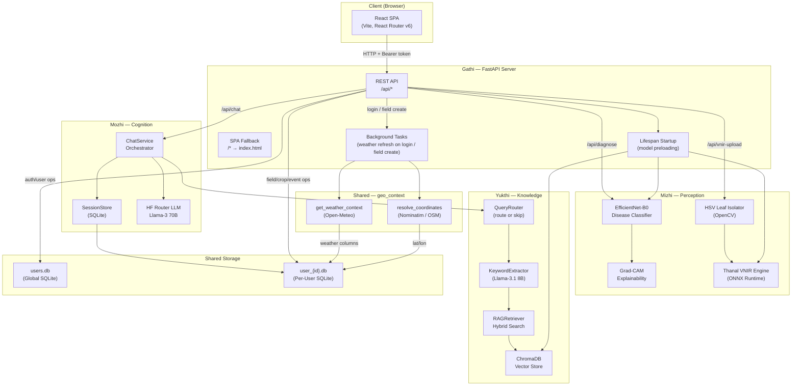

# NAVA — High-Level Project Overview

> *"From diagnostic tool to digital agronomist."*

---

## 1. What is NAVA?

**NAVA** (Next-gen Agricultural Virtual Assistant) is a full-stack AI platform designed to bring expert-level agricultural guidance to smallholder farmers — particularly in regions like Kerala, India, where access to timely agronomic expertise is critically scarce.

It is not just a disease detector. NAVA is a complete digital agronomist that:

- **Sees** — detects crop diseases from a smartphone photo with high precision
- **Senses** — monitors plant stress *before* visible symptoms appear using virtual near-infrared (VNIR) analysis
- **Speaks** — answers farming questions in a contextual, memory-aware, multilingual conversation
- **Remembers** — builds a persistent record of each farm's health history across an entire growing season
- **Grounds itself** — retrieves verified agricultural extension documents to prevent hallucinated advice

---

## 2. The Problem NAVA Solves

Crop diseases cause an estimated **20–30% reduction in global agricultural yields annually**. For smallholder farmers, this is existential. The traditional response — manual inspection by local extension officers — is slow, subjective, inaccessible, and fundamentally **reactive**. By the time disease is visible, it has already spread.

Existing AI tools have compounded this problem in different ways:

| Gap | Why it matters |
|-----|----------------|
| Trained on lab datasets | Fails in real-world field conditions (variable lighting, complex backgrounds) |
| Single-model approach | Cannot detect stress before visible lesions form |
| Generic LLMs | Prone to hallucinating chemical dosages — a genuine safety risk for farmers |
| No memory | Cannot accumulate context across a growing season |
| English-only | Inaccessible to most smallholder farmers |

NAVA was designed to close all of these gaps simultaneously.

---

## 3. Module Map

NAVA is structured as a monorepo under `nava_core/` with four named functional modules and a shared library.

```
nava_core/
├── gathi/          ← Orchestration: FastAPI backend + React SPA frontend
├── mizhi/          ← Perception: Disease detection + VNIR stress monitoring
├── mozhi/          ← Cognition: LLM chatbot + hierarchical memory
├── yukthi/         ← Knowledge: RAG pipeline + ChromaDB vector store
└── shared/         ← Foundation: Config, schemas, storage, utilities
```

### Gathi (ഗതി — "Path / Movement")
The orchestration layer. Gathi is the FastAPI server that binds all modules together and exposes them through a clean REST API. It also serves the compiled React single-page application. Everything a user does flows through Gathi.

### Mizhi (മിഴി — "Eye / Vision")
The perception layer. Mizhi contains two sub-systems: the EfficientNet-B0 disease classifier that identifies 34 pathologies across 7 crops, and the Thanal VNIR estimation engine that detects physiological plant stress before visible symptoms form.

### Mozhi (മൊഴി — "Language / Voice")
The cognition layer. Mozhi handles the conversational AI: routing messages to a large language model via the Hugging Face Inference API, managing per-session chat history, summarising old conversations into compressed memory, and extracting farmer actions into persistent crop notes.

### Yukthi (യുക്തി — "Logic / Reasoning")
The knowledge layer. Yukthi implements the full Retrieval-Augmented Generation (RAG) pipeline: ingesting agricultural extension documents, embedding them into a ChromaDB vector store, and retrieving the most relevant passages at query time using a hybrid semantic + LLM-keyword search strategy.

### Shared
The foundation layer. Provides the `Settings` configuration singleton, all Pydantic request/response schemas, SQLite-backed storage classes for users and farm data, and utility functions for image encoding, logging, and path resolution.

---

## 4. System Architecture

### 4.1 High-Level Architecture

The following diagram abstracts internal implementation details and shows only the real system flows between the major concerns of the platform.

```mermaid
graph TD
    User(["👨‍🌾 Farmer\n(Browser)"])

    subgraph NAVA ["NAVA Platform"]
        GW["🔀 API Gateway\n& Auth"]

        subgraph Perception ["👁 Perception"]
            D["Disease Detection"]
            V["VNIR Stress Monitoring"]
        end

        subgraph Cognition ["🧠 Cognition"]
            C["Chat & Memory"]
        end

        subgraph Knowledge ["📚 Knowledge"]
            R["RAG Retrieval"]
            K["Vector Store"]
        end

        subgraph Storage ["🗄 Storage"]
            DB["Farm Data\n& Sessions"]
        end
    end

    LLM(["☁ External LLM\n(Hugging Face)"])
    GEO(["🌍 Nominatim\n(OSM Geocoder)"])
    WX(["🌤 Open-Meteo\n(Weather API)"])

    User -- "Leaf Photo" --> GW
    User -- "Chat Message" --> GW
    User -- "Farm Management" --> GW

    GW --> D
    GW --> V
    GW --> C
    GW --> DB

    D -- "Events" --> DB
    V -- "Events" --> DB
    C -- "Farm Context" --> DB
    C -- "Retrieve" --> R
    R --> K
    C -- "Generate" --> LLM
    LLM -- "Reply" --> C
    C -- "Save Session" --> DB

    GW -- "On Login / Field Create" --> GEO
    GEO -- "lat/lon" --> DB
    DB -- "lat/lon" --> WX
    WX -- "Weather" --> DB

    GW -- "Results" --> User

    style NAVA fill:#0d1f0d,stroke:#22c55e,stroke-width:2px
    style Perception fill:#1a1400,stroke:#f59e0b
    style Cognition fill:#0f1a2e,stroke:#3b82f6
    style Knowledge fill:#1a0a2e,stroke:#8b5cf6
    style Storage fill:#1a0a0a,stroke:#ef4444
    style LLM fill:#1a1a2e,stroke:#6366f1
    style GEO fill:#0a1a1a,stroke:#22d3ee
    style WX fill:#0a1a1a,stroke:#38bdf8
```



### 4.2 Detailed Architecture

The following diagram shows the full internal structure, component-by-component, with precise data flows and storage interactions.



---

## 5. Data Storage Overview

NAVA uses three distinct storage backends, each chosen for a specific purpose.

### 5.1 Global User Database (`users.db`)
A single SQLite file shared across all users. Stores user accounts, bcrypt-hashed passwords, and session tokens with TTL management. Lives at `logs/users/users.db`.

### 5.2 Per-User Farm Database (`user_{id}.db` or configured path)
A separate SQLite file per authenticated user, stored inside the `FieldStore` path derived from the user record. Contains the full farm hierarchy:

```
Field → Crops → Plants → Events (diagnose / vnir)
                       → VNIR History (ratio timeseries)
```

Chat sessions are stored in a sibling SQLite file (`mozhi_sessions.db` or the same user DB path) managed by `SessionStore`, containing chat messages, summaries, and context bindings.

### 5.3 ChromaDB Vector Store
A persistent ChromaDB instance stored at `logs/chroma/`. Organised into **one collection per crop** (e.g., `nava_banana`, `nava_rice`). Each collection stores text chunks from agricultural extension documents, along with their embeddings (BAAI/bge-small-en-v1.5, 384 dimensions) and metadata (source filename, section header, chunk index).

### 5.4 Model Files
NAVA ships two model artifacts (not committed to the repository, loaded at runtime):
- `models/EfficientNet-B0.pth` — PyTorch checkpoint for the disease classifier
- `models/ThanalModel.onnx` — ONNX export of the UNet+Attention-Gate VNIR estimator

---

## 6. External Integrations

| Integration | Purpose | Configuration Key |
|------------|---------|-------------------|
| **Hugging Face Router API** | LLM inference (Llama-3 70B for chat, Llama-3.1 8B for summarisation and routing) | `HF_API_KEY`, `HF_MODEL`, `HF_ROUTER_CHAT_URL` |
| **BAAI/bge-small-en-v1.5** | Text embeddings for RAG retrieval (via sentence-transformers) | `NAVA_YUKTHI_EMBED_MODEL` |
| **sentence-transformers** | Local embedding inference — no external API call for RAG embeddings | (pip dependency) |
| **ONNX Runtime** | CPU-efficient inference for the Thanal VNIR model | (pip dependency) |
| **Nominatim (OpenStreetMap)** | Free geocoder to resolve field location strings to lat/lon. Called once per field at creation time; coordinates persisted in DB so Nominatim is never called again for that field. | None required (fair-use: 1 req/sec) |
| **Open-Meteo** | Free, no-key weather API. Returns current temperature, humidity, precipitation, and wind speed given lat/lon. Called on login (all user fields) and on field create/edit. Results persisted in DB. | None required |

All LLM calls go to `https://router.huggingface.co/v1/chat/completions`, an OpenAI-compatible endpoint. No proprietary SDK is used — raw `httpx` POST requests with JSON bodies.

---

## 7. Tech Stack

### Backend
| Component | Technology |
|-----------|-----------|
| API framework | FastAPI 0.115+ |
| ASGI server | Uvicorn |
| ML inference | PyTorch (EfficientNet), ONNX Runtime (Thanal) |
| Computer vision | OpenCV, torchvision transforms |
| Vector store | ChromaDB (persistent) |
| Embeddings | sentence-transformers (BAAI/bge-small-en-v1.5) |
| Image processing | Pillow |
| Data validation | Pydantic v2 |
| Database | SQLite (via stdlib `sqlite3`) |
| Password hashing | bcrypt |
| Configuration | python-dotenv + dataclass |
| Logging | stdlib logging |

### Frontend
| Component | Technology |
|-----------|-----------|
| Framework | React 18 |
| Bundler | Vite |
| Routing | React Router v6 |
| HTTP client | `fetch` (no axios) |
| Styling | Vanilla CSS (single `styles.css`, ~80 KB) |
| State | React `useState` + `useEffect` hooks |
| Auth state | React Context (`AuthProvider`) |

---

## 8. Deployment Topology

NAVA runs as a **single server process**. FastAPI serves both the API and the compiled React SPA from the same process:

```
uvicorn nava_core.gathi.api.main:app --host 0.0.0.0 --port 8000
```

1. **Startup**: The lifespan hook initialises ChromaDB in the main thread (required for Rust FFI safety), then spins background threads to load EfficientNet-B0 and the VNIR ONNX model.
2. **Serving**: API routes under `/api/*` are handled by FastAPI routers. All other paths fall through to the SPA fallback, which serves `frontend/dist/index.html`.
3. **Frontend assets**: Compiled JS/CSS assets are served from `/assets/{path}` with correct MIME types.

The system requires no external database server, no message broker, and no container orchestration for a basic deployment. A single `run.py` or `uvicorn` command starts everything.

---

## 9. Phase History

### Phase 1 — Validated Diagnostic Pipeline
Established the core dual-model architecture: EfficientNet-B0 for disease classification and Llama 3.1 8B for prescription generation. Validated across 20,400 training samples and 4,089 test samples with 94.54% accuracy.

### Phase 2 — The Full Digital Agronomist (Current)
Transformed the pipeline into a full-stack application with persistent user accounts, field/crop/plant management, contextual chat memory, RAG-grounded advisory, Grad-CAM explainability, and the Thanal VNIR stress monitoring engine. Additional features implemented in this phase include:
- **Two-level VNIR stress alerts**: `WARNING` (rolling-window comparison) and `CRITICAL` (baseline comparison)
- **DB-backed weather context**: Geocoding via Nominatim and live weather via Open-Meteo, stored persistently in the `fields` table and refreshed on login and field creation
- **Field management**: Create, edit, and delete fields with full cascade deletion of all associated data
- **WeatherStrip UI**: Compact live weather display on the crop overview with relative timestamp and manual refresh
- **Smart crop notes**: LLM-extracted farmer actions appended automatically from chat summaries

---

## 10. Project Information

- **Degree:** M.Sc. Artificial Intelligence and Machine Learning (2024–2026)
- **Institution:** School of Artificial Intelligence and Robotics, Mahatma Gandhi University, Kottayam, Kerala
- **Team:** Dhanus VS (MG24C3135006) · Sreegovind S (MG24C3135011)
- **Internal Guide:** Ms. Mintu Movi, Assistant Professor, School of AI & Robotics, MGU
- **External Guide:** Dr. Hsing-Kuo Pao, Professor, Department of CSIE, National Taiwan University of Science and Technology
