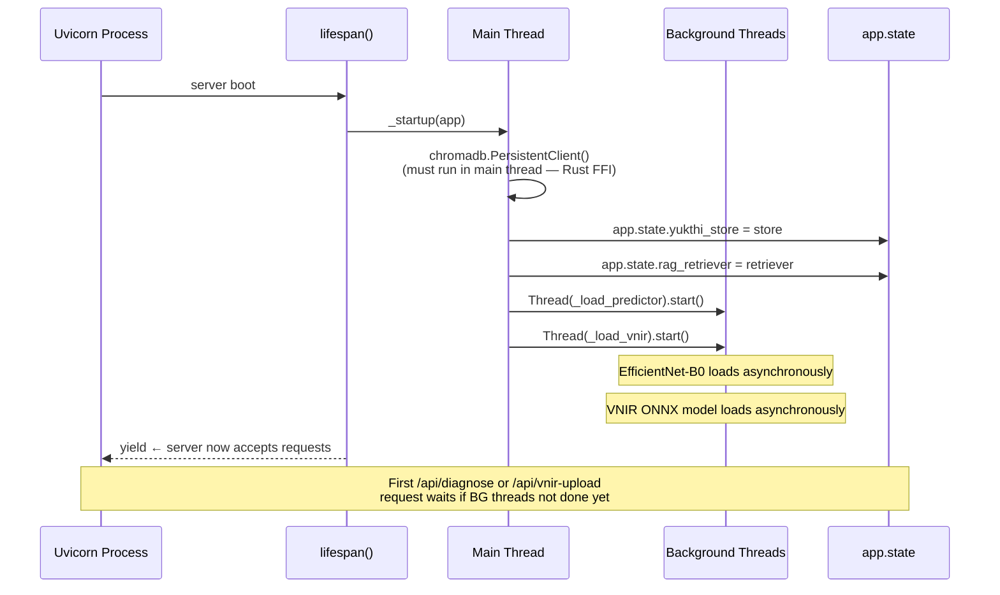
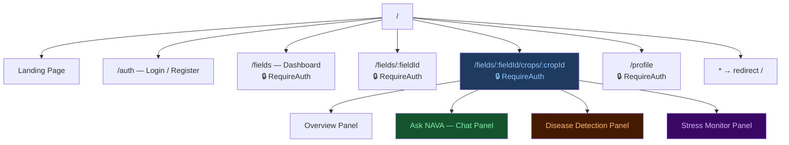
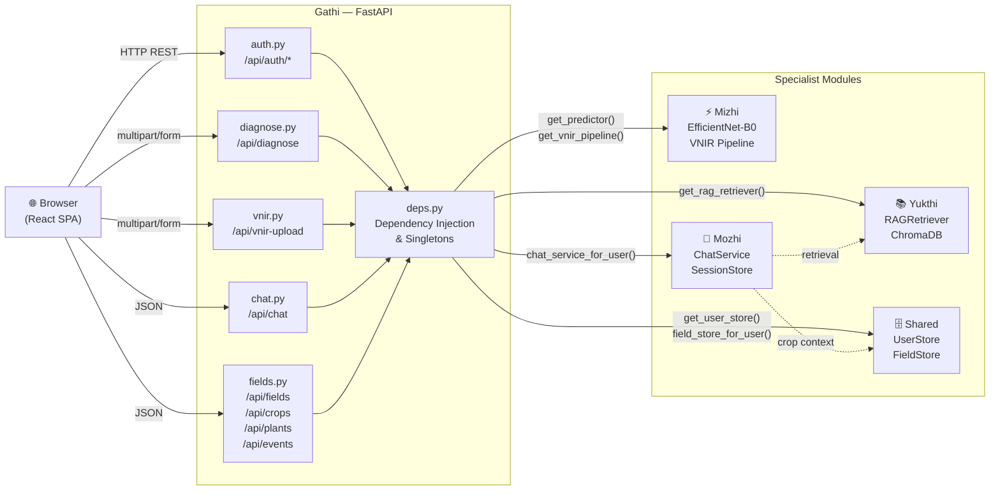

# Gathi — API Server & Frontend Orchestration

> **Module role:** The orchestration layer. Gathi is the entry point for every user interaction — it binds all other modules together behind a unified REST API and serves the compiled React single-page application.

---

## 1. What is Gathi?

The name *Gathi* (ഗതി) means "path" or "movement" in Malayalam. It is an apt name for the module that routes everything: user authentication, disease scan requests, stress monitoring uploads, chat messages, and farm management operations all flow through Gathi's API layer.

Gathi has two distinct halves:

1. **Backend** — A FastAPI application that exposes all NAVA capabilities as REST endpoints, manages authentication, orchestrates model inference, and delegates work to the other modules.
2. **Frontend** — A React 18 single-page application (built with Vite) that provides the user interface, communicating with the backend exclusively through the API.

These two halves are co-located but independently deployable. In production, the FastAPI server compiles and serves the React SPA from the same process, so the user only ever interacts with a single origin.

---

## 2. File Structure

```
nava_core/gathi/
├── __init__.py
├── api/
│   ├── __init__.py
│   ├── main.py          ← FastAPI app, CORS, router registration, SPA fallback
│   ├── startup.py       ← Lifespan hook: model preloading strategy
│   ├── deps.py          ← FastAPI dependency functions (singletons, auth)
│   └── routers/
│       ├── __init__.py
│       ├── auth.py      ← /api/auth/*
│       ├── diagnose.py  ← /api/diagnose
│       ├── vnir.py      ← /api/vnir-upload, /api/vnir-clear
│       ├── chat.py      ← /api/chat, /api/chat/history, /api/chat/clear, /api/chat/summary
│       └── fields.py    ← /api/fields, /api/crops, /api/plants, /api/events, /api/field-context, /api/crop-context, /api/field-notes
└── frontend/
    ├── index.html
    ├── package.json
    ├── vite.config.js
    └── src/
        ├── main.jsx         ← React entry point, BrowserRouter
        ├── App.jsx          ← Route definitions
        ├── styles.css       ← Global design system (~80 KB)
        ├── lib/
        │   ├── api.js       ← apiFetch wrapper (token injection)
        │   └── auth.js      ← token localStorage helpers
        ├── components/
        │   ├── AuthProvider.jsx   ← Auth context + useAuth hook
        │   ├── Layout.jsx         ← Shared nav wrapper
        │   └── crop/              ← Tool panels for the CropDetail workspace
        │       ├── ChatPanel.jsx
        │       ├── DiagnosePanel.jsx
        │       ├── MonitorPanel.jsx
        │       ├── OverviewPanel.jsx
        │       └── PlantSelector.jsx
        └── pages/
            ├── Landing.jsx
            ├── Auth.jsx
            ├── Fields.jsx
            ├── FieldDetail.jsx
            ├── CropDetail.jsx
            └── Profile.jsx
```

---

## 3. Backend Architecture

### 3.1 The FastAPI Application (`main.py`)

The root FastAPI application is created in `main.py` with version `0.2.0`. It performs three jobs:

**CORS configuration:**
```python
app.add_middleware(
    CORSMiddleware,
    allow_origins=["http://localhost:5173", "http://localhost:3000", "http://127.0.0.1:5173"],
    allow_credentials=True,
    allow_methods=["*"],
    allow_headers=["*"],
)
```
During development, the Vite dev server runs on port 5173. CORS is explicitly opened for that origin. In production, both the API and SPA share the same origin (port 8000), so CORS headers are not strictly needed but don't interfere.

**Router registration:**
All five routers are registered on the application, each with its own prefix:
```python
app.include_router(auth.router)      # prefix: /api/auth
app.include_router(diagnose.router)  # prefix: /api
app.include_router(vnir.router)      # prefix: /api
app.include_router(chat.router)      # prefix: /api
app.include_router(fields.router)    # prefix: /api
```

**SPA serving:**
Two routes handle the frontend. Asset files (JS, CSS, fonts) are served directly from `frontend/dist/assets/` with correct MIME types. Everything else falls through to a catch-all `/{path:path}` route that returns `index.html` — this is the standard pattern for client-side routing in a single-page application.

```python
@app.get("/{path:path}", response_class=HTMLResponse)
def spa_fallback(path: str) -> HTMLResponse:
    index = FRONTEND_DIR / "index.html"
    if index.exists():
        return HTMLResponse(index.read_text(encoding="utf-8"))
```

### 3.2 Startup Strategy (`startup.py`)

The most architecturally interesting part of Gathi's backend is its startup sequence. NAVA loads three heavy resources at boot time: the EfficientNet-B0 model (~20 MB PyTorch checkpoint), the VNIR ONNX model, and ChromaDB with its embedding model. Loading all three synchronously would make the server unavailable for 15–30 seconds on first boot.

The solution uses FastAPI's **lifespan context manager** with a careful threading strategy:

```python
@asynccontextmanager
async def lifespan(app: "FastAPI"):
    _startup(app)  # synchronous
    yield
    # No explicit teardown needed
```

Inside `_startup()`:

1. **ChromaDB is loaded synchronously in the main thread.** ChromaDB uses a Rust-based FFI layer (via its native Python bindings). If a `PersistentClient` is created inside a worker thread or async context, it can produce Rust FFI panics. Loading it synchronously in the main lifespan coroutine (which runs in the main thread before any requests are accepted) is the safe pattern.

2. **EfficientNet-B0 and VNIR are loaded in background daemon threads.** These are pure Python/PyTorch operations with no FFI constraints. By loading them in background threads, the server starts accepting requests immediately. The first request to `/api/diagnose` or `/api/vnir-upload` that arrives before the models finish loading will trigger the `lru_cache` to wait for model construction — but this is rare in practice.

```python
t1 = threading.Thread(target=_load_predictor, daemon=True, name="startup-efficientnet")
t2 = threading.Thread(target=_load_vnir, daemon=True, name="startup-vnir")
t1.start()
t2.start()
```

The loaded singletons are stored on `app.state`:
```python
app.state.yukthi_store = store
app.state.rag_retriever = retriever
```

This `app.state` pattern is the FastAPI-idiomatic way to share objects across request handlers without global variables.

### Startup Sequence



### 3.3 Dependency Injection (`deps.py`)

FastAPI's dependency injection system is used extensively. All heavy objects are accessed through dependency functions decorated with `@lru_cache`, which ensures they are constructed exactly once across the entire process lifetime:

```python
@lru_cache
def get_predictor() -> "EfficientNetB0Predictor":
    s = get_settings()
    return EfficientNetB0Predictor(
        model_path=s.efficientnet_model_path,
        labels_path=s.efficientnet_labels_path,
        device=s.torch_device,
        confidence_threshold=s.confidence_threshold,
    )
```

The key dependency functions are:

| Function | Returns | Scope |
|----------|---------|-------|
| `get_predictor()` | `EfficientNetB0Predictor` | Process singleton (lru_cache) |
| `get_vnir_pipeline()` | `VNIRPipeline` | Process singleton (lru_cache) |
| `get_user_store()` | `UserStore` | Process singleton (lru_cache) |
| `get_settings()` | `Settings` | Process singleton (lru_cache) |
| `require_user(authorization)` | `UserRecord` | Per-request (validates token) |
| `field_store_for_user(user)` | `FieldStore` | Per-request (per-user DB path) |
| `session_store_for_user(user)` | `SessionStore` | Per-request |
| `chat_service_for_user(user, request)` | `ChatService` | Per-request (assembles full service) |
| `get_rag_retriever(request)` | `RAGRetriever \| None` | Per-request (reads from app.state) |

The `require_user` dependency extracts the Bearer token from the `Authorization` header, validates it against the `UserStore`, and returns the `UserRecord`. Any router that declares `user: UserRecord = Depends(require_user)` is automatically protected — FastAPI returns a 401 if the token is missing or invalid before the route handler runs.

### 3.4 API Router Inventory

#### Auth Router (`/api/auth`)
| Method | Path | Action |
|--------|------|--------|
| POST | `/api/auth/register` | Create account, return session token |
| POST | `/api/auth/login` | Authenticate, return session token |
| POST | `/api/auth/logout` | Acknowledge logout (token invalidation is client-side) |
| GET | `/api/auth/me` | Return current user profile |
| PUT | `/api/auth/me` | Update display name |
| PUT | `/api/auth/password` | Change password (requires current password) |
| DELETE | `/api/auth/me` | Delete account and all associated data |

Both `register` and `login` trigger a background task to preload ML models, so they are warm by the time the user's first scan request arrives.

#### Diagnose Router (`/api`)
| Method | Path | Action |
|--------|------|--------|
| POST | `/api/diagnose` | Upload image, run EfficientNet inference, return prediction + Grad-CAM |

The diagnose router accepts a multipart form upload (`image`, `plant_id`, `crop_id`, `field_id`). It first runs a fast `predict()` call (no gradient computation). If the result is `UNRELIABLE`, it stops and records the event without generating a Grad-CAM. If `RELIABLE`, it runs `predict_with_cam()` which computes the Grad-CAM attention map in a single forward pass — no double inference.

#### VNIR Router (`/api`)
| Method | Path | Action |
|--------|------|--------|
| POST | `/api/vnir-upload` | Upload leaf image, run VNIR pipeline, return stress analysis + images |
| POST | `/api/vnir-clear` | Clear VNIR history for a plant |

#### Chat Router (`/api`)
| Method | Path | Action |
|--------|------|--------|
| POST | `/api/chat` | Send message, get reply (with RAG context if applicable) |
| POST | `/api/chat/history` | Fetch full message history for a session |
| POST | `/api/chat/clear` | Delete all messages and summaries for a session |
| POST | `/api/chat/summary` | Return the current memory summary for a session |

#### Fields Router (`/api`)
| Method | Path | Action |
|--------|------|--------|
| GET/POST/PUT | `/api/fields` | List / create / update fields |
| GET/POST/PUT/DELETE | `/api/crops` | List / create / update / delete crops |
| GET/POST/DELETE | `/api/plants` | List / create / delete plants |
| GET/POST | `/api/field-context` | Get / update auto-generated field context |
| GET | `/api/field-context/refresh` | Force-regenerate field context from current data |
| POST | `/api/crop-context` | Update crop notes |
| GET/DELETE | `/api/events` | List events / delete a single event |
| DELETE | `/api/plants/{plant_id}/history` | Clear plant scan history |
| POST | `/api/field-notes` | Save manually written field notes |

Every mutation to the field/crop/plant hierarchy triggers `_refresh_field_context()`, which regenerates the `shared_context` text field in the fields table. This auto-context is what gets injected into chat conversations as background knowledge.

---

## 4. Frontend Architecture

### 4.1 Technology Stack

The frontend is a React 18 application bundled with Vite. Routing is handled by `react-router-dom` v6. There is no CSS framework — all styling is written in a single `styles.css` file (~80 KB) that implements a bespoke dark-mode design system with CSS custom properties.

### 4.2 Application Entry Points

`main.jsx` creates the React root and wraps the app in `BrowserRouter`:
```jsx
ReactDOM.createRoot(document.getElementById('root')).render(
  <React.StrictMode>
    <BrowserRouter>
      <App />
    </BrowserRouter>
  </React.StrictMode>
)
```

`App.jsx` defines all routes. Protected routes are wrapped in a `RequireAuth` component that reads from the auth context and redirects unauthenticated users to `/auth`. The `CropDetail` route uses a special `CropLayout` (no inner padding) because it manages its own full-height workspace.

```jsx
<Routes>
  <Route path="/"        element={<Landing />} />
  <Route path="/auth"    element={<Auth />} />
  <Route path="/fields"  element={<RequireAuth><Layout><Fields /></Layout></RequireAuth>} />
  <Route path="/fields/:fieldId"
         element={<RequireAuth><Layout><FieldDetail /></Layout></RequireAuth>} />
  <Route path="/fields/:fieldId/crops/:cropId"
         element={<RequireAuth><CropLayout><CropDetail /></CropLayout></RequireAuth>} />
  <Route path="/profile" element={<RequireAuth><Layout><Profile /></Layout></RequireAuth>} />
  <Route path="*"        element={<Navigate to="/" replace />} />
</Routes>
```

### Frontend Route Tree



### 4.3 Authentication Context (`AuthProvider`)

All authentication state lives in a React context provided by `AuthProvider`. The context stores the current `user` object and a `loading` flag, and exposes `login()` and `logout()` functions.

- **Token storage:** The JWT-like session token is persisted in `localStorage` under the key `nava_token`.
- **User persistence:** The user object is stored in `localStorage` under `nava_user` as JSON.
- **Hydration:** On mount, `AuthProvider` reads both from localStorage and validates the token against `/api/auth/me`. If the token is expired or invalid, the user is logged out.

```jsx
const { user, loading, login, logout } = useAuth();
```

### 4.4 API Client (`lib/api.js`)

All backend communication goes through the `apiFetch` wrapper:

```javascript
export async function apiFetch(path, options = {}) {
    const token = getToken();
    const headers = { ...options.headers };
    if (token) headers['Authorization'] = `Bearer ${token}`;
    const res = await fetch(path, { ...options, headers });
    if (!res.ok) {
        const body = await res.json().catch(() => ({}));
        throw new Error(body.detail || `HTTP ${res.status}`);
    }
    return res.json();
}
```

This wrapper:
1. Reads the stored token and injects it as a Bearer header on every request.
2. Throws a descriptive error for non-2xx responses (using the FastAPI `detail` field from the JSON error body).
3. Returns the parsed JSON body on success.

No external HTTP library (axios, ky) is used. This keeps the bundle small and the behaviour predictable.

### 4.5 Layout Structure

`Layout.jsx` provides the shared application shell for authenticated pages: a top navigation bar with the NAVA logo, links to `/fields` and `/profile`, and a logout button. The inner content area has standard padding.

`CropLayout` is a variant of `Layout` with `noPadding=true`, passed to the `CropDetail` page, which manages its own internal layout (sidebar + main content area) at full viewport height.

---

## 5. How Gathi Connects the Modules

Gathi does not implement business logic itself — it is a coordination layer. Each router delegates to the appropriate specialist module:

```
/api/diagnose   → Mizhi (EfficientNetB0Predictor, GradCamGenerator)
/api/vnir-*     → Mizhi (VNIRPipeline → VNIREngine + VNIRAnalyzer)
/api/chat       → Mozhi (ChatService → ChatClient, SessionStore, RAGRetriever)
/api/fields     → Shared (FieldStore)
/api/auth       → Shared (UserStore)
```

The startup hook ensures that when any router's dependency function is called for the first time, the heavy singleton it needs is already loaded (or loading in the background). The `deps.py` dependency functions are the precise integration seam: they translate FastAPI's dependency injection system into calls to the module layer.

### Module Routing Map



---

## 6. Security Model

- **Authentication:** Token-based. Each session token is a 32-byte random hex string generated at login/register and stored in the user database with an expiry timestamp (`session_ttl_hours`, default 168 hours / 7 days).
- **Authorization:** All protected routes require a valid token via `require_user`. Farm data is scoped per-user through the `FieldStore(Path(user.db_path))` pattern — each user's data lives in a separate database file keyed to their user ID.
- **Password storage:** bcrypt with a random salt. Passwords are never stored in plaintext.
- **Data isolation:** A user can only access their own fields, crops, plants, and chat sessions. There are no shared farm resources — each user's database is fully private.
