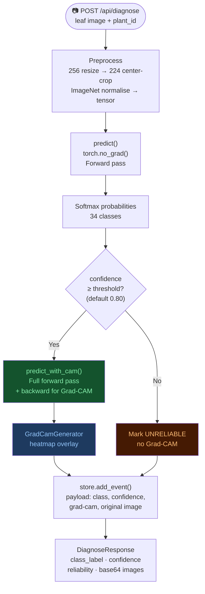
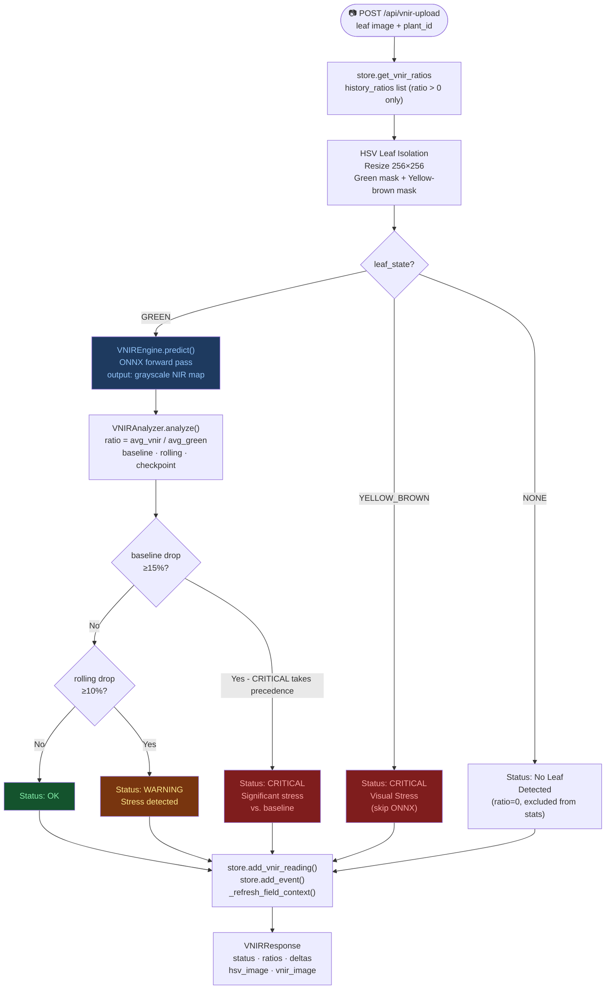

# Mizhi — Disease Detection & VNIR Stress Monitoring

> **Module role:** The perception layer. Mizhi gives NAVA its two most fundamental capabilities: seeing what disease has afflicted a crop, and sensing whether a plant is physiologically stressed before any visible symptoms appear.

---

## 1. What is Mizhi?

The name *Mizhi* (മിഴി) means "eye" or "vision" in Malayalam. Mizhi is NAVA's sensory system — it processes raw images from a smartphone and extracts two distinct types of information:

1. **Disease Detection** — What pathology, if any, is visible on this leaf? Using a deep convolutional neural network trained on a curated multi-dataset corpus, Mizhi classifies leaf images into 34 disease categories across 7 crops, with an accuracy of 94.54%.

2. **VNIR Stress Monitoring** — Is this plant physiologically stressed, even before disease symptoms are visible? Using the Thanal ONNX model, Mizhi estimates a virtual near-infrared (VNIR) signal from the standard RGB image and tracks changes in the plant's NIR/Green reflectance ratio over time.

These two sub-systems are independent pipelines that share a common upstream data flow: both receive a PIL image and a plant identifier, and both write their results to the farm event log via the `FieldStore`.

---

## 2. File Structure

```
nava_core/mizhi/
├── __init__.py
├── detection/
│   ├── __init__.py
│   ├── inference.py    ← EfficientNetB0Predictor class + PredictionResult
│   ├── gradcam.py      ← GradCamGenerator (hook-based Grad-CAM)
│   └── labels.py       ← Label file loader
└── vnir/
    ├── __init__.py
    ├── pipeline.py     ← VNIRPipeline (HSV isolation + inference + analysis)
    ├── inference.py    ← VNIREngine (ONNX model wrapper)
    ├── analyzer.py     ← VNIRAnalyzer (ratio computation, checkpoint logic)
    └── validation.py   ← plant_id validation utility
```

---

## 3. Disease Detection Sub-System

### High-Level Mizhi Overview

Mizhi operates as two independent pipelines sharing a common entry point. Both receive a raw image and a plant identifier; both write their findings to the farm event store.

```mermaid
flowchart LR
    Input(["Leaf Photo\n+ plant_id"])

    subgraph Mizhi["Mizhi — Perception"]
        direction TB
        subgraph Detection["Disease Detection"]
            EN["EfficientNet-B0\nClassifier"]
            GC["Grad-CAM\nExplainer"]
        end
        subgraph VNIR_["VNIR Monitoring"]
            HSV["HSV Leaf\nIsolator"]
            TH["Thanal ONNX\nInference"]
            AN["Ratio\nAnalyzer"]
        end
    end

    Store(["Farm Event\nStore"])
    Chat(["Chat Context"])

    Input --> Detection
    Input --> VNIR_
    EN --> GC
    HSV --> TH --> AN
    Detection -- "class + confidence + heatmap" --> Store
    VNIR_ -- "ratio + status" --> Store
    Store -- "scan history" --> Chat

    style Mizhi fill:#1a1400,stroke:#f59e0b,stroke-width:2px
    style Detection fill:#1a0700,stroke:#f97316
    style VNIR_ fill:#0a1a1a,stroke:#14b8a6
```



### 3.1 The Dataset — Superset Strategy

The EfficientNet-B0 model was not trained on a single benchmark dataset. Instead, a **Superset** was constructed by aggregating six open-source repositories:

| Source | Primary Coverage |
|--------|-----------------|
| PlantVillage | Controlled lab images, 38 classes |
| PlantWild V1 & V2 | Field-condition images, higher variance |
| PlantDoc | Diverse field images, multiple pathogens |
| PaddyDoctor | Rice-specific diseases (Kerala-relevant) |
| ASDID | Soybean disease imagery |
| Kaggle competition datasets | Mixed crops |

The aggregation covered **34 disease classes across 7 major crops**: Rice, Corn, Tomato, Soybean, Cassava, Banana, and Cucumber — including a healthy class for each crop.

**Class balancing:** A strict **300–700 filter rule** was applied. Any class with fewer than 300 samples was excluded (insufficient data for reliable learning). Any class exceeding 700 samples was downsampled to prevent the majority classes from dominating gradient updates. This produced a balanced corpus where no class disproportionately biases the classifier.

**Augmentation:** Remaining training images were augmented using the Albumentations library to simulate real-world field variability:
- Geometric transforms (horizontal/vertical flip, random rotation, elastic distortion)
- Brightness/contrast variation (to handle different lighting conditions)
- RGB channel shift (to simulate different smartphone camera sensors)
- Gaussian blur (to simulate camera shake and out-of-focus shots)

The **final dataset**: 20,400 training/validation samples + 4,089 test samples.

### 3.2 Model Selection — The Comparison Study

Three architectures were trained and evaluated under identical conditions (same dataset, same hardware, same hyperparameters):

| Model | Architecture Principle | Best Val. Accuracy | Training Time |
|-------|----------------------|-------------------|---------------|
| ResNet-50 | Depth scaling (residual connections) | 85.39% | 5 min 00 sec |
| MobileNetV2 | Width scaling (depthwise separable convolutions) | 83.53% | 4 min 34 sec |
| **EfficientNet-B0** | **Compound scaling (depth + width + resolution)** | **94.54%** | 4 min 38 sec |

**Why EfficientNet-B0 won:**
EfficientNet's compound scaling coefficient jointly scales network depth, width, and input resolution in a principled ratio. This produces a model that is simultaneously more accurate and more parameter-efficient than depth-only (ResNet) or width-only (MobileNet) architectures. At 94.54% accuracy with a training time comparable to MobileNetV2, it confirmed that compound scaling is the right paradigm for this classification task.

### 3.3 The `EfficientNetB0Predictor` Class

The predictor is a production-grade wrapper around the PyTorch model checkpoint. It is instantiated once at server startup (via `@lru_cache` in `deps.py`) and reused across all requests.

**Initialisation sequence:**
```python
class EfficientNetB0Predictor:
    def __init__(self, model_path, labels_path, device, confidence_threshold):
        self.labels = load_labels(labels_path)          # 34 class strings
        self.model = _build_model(num_classes=34)       # EfficientNet-B0 with custom head
        checkpoint = torch.load(model_path, map_location="cpu")
        model_obj, state_dict = _extract_state_dict(checkpoint)
        # handles full model, state_dict, and module.* prefixed state dicts
        self.model.load_state_dict(...)
        self.model.to(device).eval()
        self._transform = transforms.Compose([
            transforms.Resize(256),
            transforms.CenterCrop(224),
            transforms.ToTensor(),
            transforms.Normalize(mean=[0.485, 0.456, 0.406], std=[0.229, 0.224, 0.225]),
        ])
        self._cam = GradCamGenerator(self.model, self.model.features[-1])
```

The `_build_model()` function creates a stock EfficientNet-B0 (weights=None) and replaces the final classifier head with a linear layer sized to `num_classes`. This is the standard transfer-learning head replacement pattern.

**Checkpoint loading robustness:** The `_extract_state_dict()` function handles three checkpoint formats transparently:
- Full serialised model object
- Dict with a `state_dict` / `model_state_dict` / `model` key
- Raw state dict
This ensures the predictor works regardless of how the model was saved during training.

**Preprocessing:** Images are resized to 256 on the shorter side, center-cropped to 224×224 (the ImageNet standard), converted to a normalised tensor. The crop is kept separately for the Grad-CAM overlay.

### 3.4 Inference: `predict()` vs. `predict_with_cam()`

Two inference modes exist, chosen based on whether the prediction is reliable:

#### `predict()` — Fast path (no Grad-CAM)
```python
def predict(self, image: Image.Image) -> PredictionResult:
    tensor, _ = self._preprocess(image)
    with torch.no_grad():
        logits = self.model(input_tensor)
        probs = torch.softmax(logits, dim=1)
        confidence, class_index = torch.max(probs, dim=1)
    # ...
    reliability = "RELIABLE" if conf >= self.confidence_threshold else "UNRELIABLE"
    return PredictionResult(class_index, class_label, confidence, reliability)
```

The `torch.no_grad()` context manager disables gradient computation, making this forward pass faster and more memory-efficient. This is the path taken for unreliable predictions — no point generating a Grad-CAM explanation if the model is not confident.

#### `predict_with_cam()` — Full path (with Grad-CAM)
```python
def predict_with_cam(self, image: Image.Image) -> Tuple[PredictionResult, Image.Image]:
    tensor, cropped = self._preprocess(image)
    # NO torch.no_grad() — gradients required for Grad-CAM
    logits = self.model(input_tensor)
    probs = torch.softmax(logits, dim=1)
    # ...
    cam_image = self._cam.generate(input_tensor, cropped, class_index)
    return result, cam_image
```

Note the critical absence of `torch.no_grad()`. Grad-CAM works by backpropagating the class score through the network to compute gradient activations at the target layer. If gradients are disabled, Grad-CAM produces a blank output. The forward pass and Grad-CAM computation are **combined into a single pass** — no double inference.

### 3.5 The Confidence Safety Gate

The `confidence_threshold` (default: 0.80, configurable via `NAVA_CONFIDENCE_THRESHOLD`) acts as a safety valve. When a prediction's softmax probability falls below this threshold, the result is flagged `UNRELIABLE`.

**Behavioural consequences of `UNRELIABLE`:**
- In the diagnose router: the event is recorded, but no Grad-CAM is generated.
- In the UI (DiagnosePanel): the result card shows "Low confidence — treat with caution" messaging.
- In the system prompt to the LLM: the crop context notes the unreliable detection, preventing the AI from treating it as ground truth.

This gate is critical for preventing harm. A farmer acting on a confidently-wrong diagnosis could apply the wrong pesticide. By surfacing uncertainty, NAVA encourages the farmer to consult a human expert.

### Disease Detection Flow (Detailed)



### 3.6 Grad-CAM Explainability (`gradcam.py`)

Gradient-weighted Class Activation Mapping (Grad-CAM) produces a heatmap that highlights which regions of the input image the model attended to when making its prediction. This transforms NAVA from a black-box oracle into an interpretable tool that shows *why* it reached a conclusion.

**Technical implementation:**

The `GradCamGenerator` registers two PyTorch hooks on the target layer (`model.features[-1]`, the final convolutional feature block):

1. **Forward hook** — captures the feature map activations during the forward pass.
2. **Backward hook** — captures the gradients flowing back through the target layer during backprop.

After the forward pass, Grad-CAM calls `.backward()` on the predicted class score. This propagates gradients back to the target layer. The gradient tensor is globally average-pooled across spatial dimensions to produce a weight vector (one weight per channel). These weights are applied to the activation maps, and the weighted sum is ReLU'd to retain only positive contributions.

The resulting low-resolution heatmap is upsampled to the original crop size (224×224), normalised to [0,1], converted to a BGR heatmap using OpenCV's `COLORMAP_JET`, and composited over the original image as a semi-transparent overlay.

The output is returned as a PIL Image and sent to the frontend as a base64-encoded JPEG alongside the original image.

---

## 4. VNIR Stress Monitoring Sub-System (Thanal)

### 4.1 The Early Detection Problem

Standard RGB-based disease detection can only identify a pathology after visible symptoms have formed — chlorosis, lesions, necrosis. By this point, the infection has often progressed significantly and treatment options are more limited.

Near-infrared (NIR) reflectance is a well-established proxy for plant physiological health. Healthy green leaves reflect strongly in the NIR band because of their cell structure (the mesophyll layer); stressed or diseased leaves reflect less. This change in NIR reflectance precedes visible symptom formation by days to weeks.

Professional multispectral cameras can measure NIR directly, but they cost thousands of dollars. Thanal takes a different approach: it **estimates the NIR signal from a standard smartphone RGB image** using a deep learning model, effectively creating a "virtual" near-infrared sensor from the camera the farmer already owns.

### 4.2 The Thanal Model Architecture

Thanal uses a **UNet with Attention Gates**. The UNet architecture is well-suited for pixel-wise prediction tasks because its encoder-decoder structure with skip connections preserves both high-level semantic information and fine-grained spatial detail. Attention gates allow the decoder to focus on relevant spatial features when upsampling, suppressing irrelevant background regions.

The model was trained to take a standard RGB leaf image (after background removal) and output a grayscale image representing the estimated NIR reflectance at each pixel.

**Performance:** 28 dB PSNR · 0.85 SSIM on held-out validation data.

**Deployment format:** The model is exported to **ONNX Runtime** format, which enables CPU inference without a GPU and without a full PyTorch runtime. The ONNX model was validated on a Raspberry Pi 4, confirming viability on edge hardware. In the NAVA server, the ONNX Runtime C-extension provides efficient inference on CPU.

### 4.3 HSV Leaf Isolation (`VNIRPipeline.isolate_leaf()`)

Before the VNIR model can estimate NIR reflectance, it needs to process only the leaf tissue — not the background, pot, hand, or anything else in the photo. Thanal solves this with **HSV multi-cascade filtering**.

The process:

1. **Resize** the input frame to 256×256 pixels (the model's expected input size).
2. **Convert to HSV** colour space (more separable for plant tissue than RGB).
3. **Green mask:** Apply an HSV range filter for green leaf tissue (hue 30–90, saturation 40+, value 40+). Morphological operations (close → open with elliptical kernels) clean up the mask.
4. **Yellow-brown mask:** Apply a separate HSV range filter for yellowed or dying tissue (hue 15–30, high saturation), which indicates advanced stress. Same morphological cleanup.
5. **Contour selection:** Find the largest contour in each mask.
6. **State determination:**
   - If the largest green contour area ≥ the largest yellow-brown contour AND ≥ 5% of the frame: `leaf_state = "GREEN"` → proceed with VNIR estimation.
   - If the yellow-brown contour dominates: `leaf_state = "YELLOW_BROWN"` → skip VNIR, immediately flag `"CRITICAL: Visual Stress"`.
   - If neither: `leaf_state = "NONE"` → `"No Leaf Detected"`.

The dual-mask strategy means Thanal can make an immediate visual diagnosis for severely stressed (yellowing) leaves before even running the ONNX model, saving inference time and providing a direct signal.

### 4.4 ONNX Inference (`VNIREngine`)

For `GREEN` leaf states, the masked RGB image (leaf pixels only, background zeroed out) is passed to the `VNIREngine`:

```python
class VNIREngine:
    def predict(self, image: Image.Image) -> Image.Image:
        # Preprocess: resize to (256, 256), normalise to [0, 1], HWC → NCHW
        input_array = np.array(image).astype(np.float32) / 255.0
        input_tensor = np.transpose(input_array, (2, 0, 1))[np.newaxis, :]
        outputs = self.session.run(None, {"input": input_tensor})
        vnir_map = outputs[0][0, 0]  # (H, W) grayscale
        vnir_uint8 = (np.clip(vnir_map, 0, 1) * 255).astype(np.uint8)
        return Image.fromarray(vnir_uint8)
```

The output is a grayscale PIL image where pixel intensity represents estimated NIR reflectance (bright = high NIR = healthy, dark = low NIR = stressed).

### 4.5 VNIR Analytics (`VNIRAnalyzer`)

The raw NIR image is not directly interpretable by a farmer. The `VNIRAnalyzer` converts it into an actionable stress assessment.

**Ratio computation:**
For each pixel within the leaf mask, both the green channel value (from the original RGB) and the VNIR estimate are extracted. Their means give:
- `avg_g` — mean green channel intensity over the leaf region
- `avg_vnir` — mean estimated NIR intensity over the leaf region
- `ratio` — NIR/Green ratio (higher = healthier)

**The Two-Level Stress Alert System:**

Rather than comparing to a fixed threshold (which would require per-species calibration data), Thanal uses a **relative comparison strategy** tied to the plant's own history:

```
History: [r1, r2, r3, r4, r5, r6, r7, r8, r9, r10, r11, ...]
                │ baseline  │   checkpoint 1  │  checkpoint 2
```

- **Baseline:** The mean of the first 5 *valid* readings (i.e., `ratio > 0`; scans where no leaf was detected are excluded). The system assumes these are taken from a healthy plant.
- **Rolling average:** Mean of the most recent 5 valid readings (ratios > 0 only).
- **Previous checkpoint avg:** Mean of readings 6–10 (the previous batch of 5).
- **Current checkpoint avg:** Mean of the latest 5 readings.

**Zero-ratio guard:** Any scan returning `ratio == 0` (produced when `leaf_state == "NONE"`) is explicitly excluded from all statistical calculations — baseline building, rolling window, and comparison. Without this guard, a single failed scan would corrupt the baseline and trigger spurious warnings.

NAVA implements **two independent alert levels**:

| Level | Comparison | Default Threshold | Priority |
|-------|-----------|-------------------|----------|
| `WARNING` | Current ratio vs. rolling mean of last 5 valid scans | Drop ≥ 10% | Lower |
| `CRITICAL` (stress) | Current ratio vs. initial 5-scan baseline mean | Drop ≥ 15% | Higher |

Both comparisons run independently on every scan. If both thresholds are simultaneously breached, `CRITICAL` takes precedence. This means: `WARNING` gives early notice of a deteriorating trend that may not yet have crossed the baseline threshold; `CRITICAL` confirms a significant departure from the plant's healthy reference point.

**Status codes:**
| Status | Condition |
|--------|-----------|
| `"Calibrating: N scans remaining"` | Fewer than 5 valid readings in history |
| `"OK: Stress within normal range"` | No significant drop detected |
| `"WARNING: Stress detected"` | Rolling-window drop ≥ 10% vs. recent mean |
| `"CRITICAL: Significant stress vs. baseline"` | Baseline drop ≥ 15% vs. initial healthy baseline |
| `"CRITICAL: Visual Stress"` | Yellow-brown leaf state detected during HSV isolation |
| `"No Leaf Detected"` | No leaf found in the image (ratio stored as 0, excluded from stats) |

All computed values (`ratio`, `avg_g`, `avg_vnir`, `baseline`, `rolling_avg`, `prev_checkpoint_avg`, `global_avg`, `vs_baseline`, `vs_global`, `vs_rolling`, `vs_prev_checkpoint`) are returned to the router in a `VNIRStats` dataclass, stored as an event, and added to the per-plant `vnir_history` timeseries table.

### 4.6 Full VNIR Pipeline Flow (Detailed)



---

## 5. Module Integration with Gathi

Mizhi is always accessed through `deps.py` singletons:

- `get_predictor()` returns the cached `EfficientNetB0Predictor`
- `get_vnir_pipeline()` returns the cached `VNIRPipeline`

These are pre-loaded at startup and ready before any request arrives. The results of both pipelines are written to the `FieldStore` (via `add_event()` and `add_vnir_reading()`), which makes them automatically available to the Mozhi chat service through the `get_rich_crop_context()` method — creating the feedback loop where scan results inform the AI's agronomic advice.
