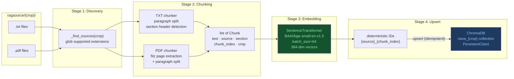
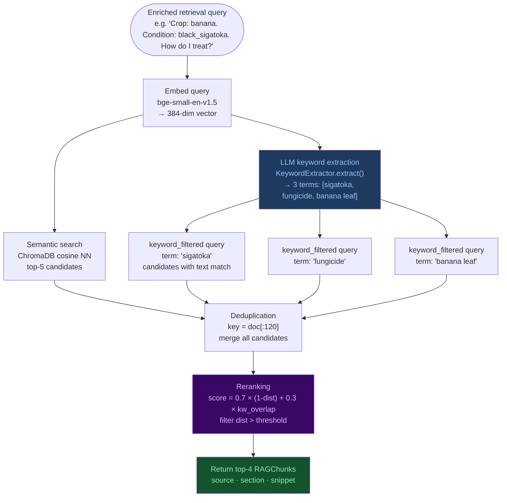

# Yukthi — RAG Pipeline & Knowledge Retrieval

> **Module role:** The knowledge layer. Yukthi prevents NAVA's language model from hallucinating agricultural advice by grounding every relevant answer in verified, source-attributed passages from authoritative agricultural extension documents.

---

## 1. What is Yukthi?

The name *Yukthi* (യുക്തി) means "logic" or "reasoning" in Malayalam. Yukthi is NAVA's knowledge base — a Retrieval-Augmented Generation (RAG) system that transforms raw PDF and text documents from agricultural extension bodies into a searchable vector database, and then retrieves the most relevant passages at query time to inject into the LLM's context.

The core motivation is safety. Generic large language models, when asked about pest management or fungicide dosages, can produce confidently-stated but factually wrong information. A farmer who applies the wrong chemical at the wrong rate can cause crop damage, environmental harm, or financial loss. By requiring NAVA's advice to be grounded in documents it can actually cite, Yukthi makes hallucination structurally much harder.

---

## 2. File Structure

```
nava_core/yukthi/
├── __init__.py
├── pipeline.py    ← RAGPipeline: document ingestion (parse → chunk → embed → upsert)
├── chunker.py     ← chunk_file(): PDF/TXT parsing and text chunking
├── store.py       ← YukthiStore: ChromaDB wrapper (collections, upsert, query)
├── retriever.py   ← RAGRetriever: hybrid semantic + keyword retrieval + reranking
├── router.py      ← QueryRouter: LLM-based binary route/skip decision
└── keywords.py    ← KeywordExtractor: LLM-based agronomic keyword extraction
```

---

## 3. Source Document Management

### 3.1 Source Layout Convention

Agricultural reference documents are stored in `ragsource/` at the project root, organised by crop:

```
ragsource/
├── banana/
│   ├── banana_diseases.txt
│   ├── management_guide.pdf
│   └── kerala_kau_practices.pdf    ← Kerala Agricultural University Package of Practices
└── rice/
    ├── rice_blast_management.txt
    └── ...
```

Each crop gets its own subfolder. All supported file types within the folder are automatically ingested. The supported extensions are registered in `chunker.py`'s `SUPPORTED_EXTENSIONS` set (`.txt`, `.pdf`) — adding a new format only requires registering a handler there.

### 3.2 Ingestion Script (`ingest.py`)

The top-level `ingest.py` provides a command-line interface for populating the ChromaDB vector store:

```bash
python ingest.py --crop banana          # ingest a single crop
python ingest.py --all                  # ingest all crops found in ragsource/
python ingest.py --crop banana --force  # re-ingest, replacing existing collection
```

The pipeline is **idempotent** — re-running without `--force` detects that the collection already exists and skips it. This is safe to run in CI or on server startup.

---

## 4. The Ingestion Pipeline (`pipeline.py`)

`RAGPipeline.ingest()` transforms source documents into ChromaDB entries in four stages.

### Ingestion Pipeline



### Stage 1 — Source Discovery

```python
def _find_sources(self, crop: str) -> list[Path]:
    crop_dir = self.source_dir / crop.lower().strip()
    return sorted(f for f in crop_dir.iterdir()
                  if f.is_file() and f.suffix.lower() in SUPPORTED_EXTENSIONS)
```

All ingestible files in `ragsource/{crop}/` are discovered automatically.

### Stage 2 — Chunking (`chunker.py`)

Each file is processed by `chunk_file(source_path, crop)`, which dispatches to a format-specific handler:

**For text files (`.txt`):**
The text is split into paragraphs at double-newline boundaries. Each paragraph is further split if it exceeds a maximum token threshold. The chunker attempts to detect section headers (lines ending with `:` or containing `===`, `---`) and preserves them as `section` metadata for downstream retrieval.

**For PDF files (`.pdf`):**
PyMuPDF (fitz) is used to extract text page-by-page. The text is then processed with the same paragraph/section logic as plain text.

Each chunk is represented as a `Chunk` dataclass:
```python
@dataclass
class Chunk:
    text: str         # the passage text
    source: str       # filename (e.g., "banana_diseases.txt")
    section: str      # detected section header or "General"
    chunk_index: int  # zero-based index within the source file
    crop: str         # crop name (e.g., "banana")
```

### Stage 3 — Batch Embedding

All chunks from all files for a given crop are embedded in a single batch call:

```python
encoder = SentenceTransformer(self.embed_model)  # BAAI/bge-small-en-v1.5
texts = [c.text for c in all_chunks]
embeddings = encoder.encode(texts, batch_size=64, show_progress_bar=False).tolist()
```

**Model choice:** `BAAI/bge-small-en-v1.5` is a 33M-parameter bi-encoder model that produces 384-dimensional dense embeddings. It is specifically optimised for semantic retrieval tasks and achieves near-state-of-the-art retrieval quality at a fraction of the size of larger models. It runs entirely locally (no external API call) via the `sentence-transformers` library.

### Stage 4 — ChromaDB Upsert

Deterministic IDs are constructed to make the upsert idempotent:
```python
ids = [f"{c.source}_{c.chunk_index}" for c in all_chunks]
# e.g., "banana_diseases.txt_0", "banana_diseases.txt_1", ...
```

Using `upsert` (not `add`) means re-running the pipeline with the same source files produces identical ChromaDB state — no duplicates, no gaps.

Metadata stored per chunk:
```python
{"crop": crop, "source": c.source, "section": c.section, "chunk_index": c.chunk_index}
```

---

## 5. The Vector Store (`store.py`)

`YukthiStore` is a thin wrapper around ChromaDB's `PersistentClient`:

```python
class YukthiStore:
    def __init__(self, chroma_dir: Path):
        import chromadb
        self.client = chromadb.PersistentClient(path=str(chroma_dir))
```

**Collection naming:** Each crop gets its own collection named `nava_{crop}` (e.g., `nava_banana`). This keeps different crops' embeddings separate and allows crop-specific retrieval without metadata filtering overhead.

**Key methods:**

| Method | Description |
|--------|-------------|
| `collection_exists(crop)` | Checks if `nava_{crop}` collection exists |
| `delete_collection(crop)` | Removes a collection (used with `--force` during re-ingestion) |
| `upsert(crop, ids, embeddings, documents, metadatas)` | Bulk insert/update chunks |
| `query(crop, embedding, n_results)` | Standard semantic similarity search |
| `query_keyword_filtered(crop, embedding, term, n_results)` | Semantic search with `where_document` text filter |

The `query_keyword_filtered()` method is the key to the hybrid retrieval strategy. ChromaDB's `where_document` parameter filters the collection to only documents that contain the specified term before performing the vector similarity search. This means the embedding similarity is computed only over the keyword-matching subset, pulling in chunks that may rank lower in pure semantic search but are directly relevant to a specific agronomic term.

---

## 6. The Hybrid Retrieval Engine (`retriever.py`)

`RAGRetriever.query()` implements a multi-stage hybrid retrieval algorithm designed to maximise recall precision for agricultural queries.

### 6.1 The Full Algorithm

```
query(message, crop, llm_keywords) → list[RAGChunk]
```

**Stage 1 — Embed the query:**
The enriched retrieval query (constructed by `ChatService._build_retrieval_query()`) is embedded using the same `bge-small-en-v1.5` model as during ingestion. This produces a 384-dimensional query vector.

**Stage 2 — Semantic search (5 candidates):**
```python
SEMANTIC_N = 5
semantic_results = self.store.query(crop=crop_norm, embedding=embedding, n_results=SEMANTIC_N)
```
This retrieves the 5 nearest-neighbour chunks from the collection by cosine distance.

**Stage 3 — Keyword-filtered semantic search:**
For each of the 3 LLM-extracted keywords:
```python
KEYWORD_PER_TERM = max(1, round(5 / max(len(search_keywords), 1)))
for term in search_keywords:
    kw_results = self.store.query_keyword_filtered(
        crop=crop_norm, embedding=embedding, term=term, n_results=KEYWORD_PER_TERM
    )
```
Each keyword query retrieves a small number of candidates that *both* match the keyword and are semantically close to the query. These keyword candidates may not appear in the top-5 semantic results (e.g., a passage about "Black Sigatoka management" might rank 8th semantically but is pulled directly by the keyword "sigatoka").

**Stage 4 — Deduplication:**
All candidates are merged using a deduplication set keyed on the first 120 characters of each document:
```python
def _add(doc, meta, dist):
    key = doc[:120]
    if key not in seen:
        seen.add(key)
        candidates.append((doc, meta, dist))
```

**Stage 5 — Reranking:**
Each candidate is scored with a combined metric:
```python
kw_score = keyword_overlap_ratio(doc, search_keywords)  # [0.0, 1.0]
combined = 0.7 * max(0.0, 1.0 - dist) + 0.3 * kw_score
```
Where `dist` is the ChromaDB cosine distance (lower = more similar). Candidates with `dist > threshold * 1.2` are filtered out (the 1.2 relaxation is applied to keyword candidates since they passed a hard content filter, so a slightly higher distance is acceptable).

**Stage 6 — Return top-K:**
The reranked candidates are sorted descending by combined score and the top `top_k` (default: 4) are returned as `RAGChunk` objects:
```python
@dataclass
class RAGChunk:
    text: str
    source: str
    section: str
    score: float  # cosine distance — lower is more similar
```

### Hybrid Retrieval Algorithm



### 6.2 Why This Design?

| Design choice | Rationale |
|--------------|-----------|
| 5 semantic + keyword-filtered | Semantic alone misses narrow agronomic terms; keyword filtering catches them |
| LLM-extracted keywords (not heuristic) | Domain terms like "Sigatoka" or "Moko disease" would be stopped by heuristic filters; LLM extracts exactly the right terms |
| 0.7/0.3 combined score | Semantic similarity dominates (topical relevance), keyword overlap provides a precision boost |
| Per-crop collections | No cross-crop contamination; rice queries cannot retrieve banana passages |
| Dedup by first 120 chars | Prevents nearly-identical chunks from duplicating in the final result set |

### 6.3 Fallback Behaviour

If `llm_keywords` is empty or keyword extraction fails, `_heuristic_fallback_terms()` extracts content words (≥4 characters, not in the stopword list) from the enriched query. This ensures the hybrid retrieval continues to function even when the small model is unavailable or rate-limited.

---

## 7. The Query Router (`router.py`)

Not every user message benefits from RAG retrieval. "Thanks, that's helpful" doesn't need a knowledge lookup. Fetching knowledge for every message adds ~1–2 seconds of latency and can dilute the prompt with irrelevant material.

`QueryRouter.should_retrieve()` uses the small LLM to make a binary decision:

```python
def should_retrieve(self, message: str, last_assistant_reply: str = "") -> bool:
    # Sends a system prompt that says:
    # "Output ONLY 'RETRIEVE' or 'SKIP'.
    #  RETRIEVE if the message asks for: disease treatment, pesticides, fertilisers,
    #  cultivation practices, varieties, irrigation, crop management advice.
    #  SKIP for: greetings, vague follow-ups, questions already answered in the reply."
    reply, error = self.client.send(prompt, model_override=self.model,
                                    temperature_override=0.0, max_new_tokens_override=5)
    return (reply or "").strip().upper().startswith("RETRIEVE")
```

The router sees both the current message and the last NAVA reply. This enables it to detect follow-up questions like "what about dosage?" — where the context of the previous reply makes it clear that treatment information is being requested.

---

## 8. Keyword Extraction (`keywords.py`)

`KeywordExtractor.extract()` asks the small LLM to produce exactly 3 precise agronomic search terms from the enriched retrieval query:

```python
def extract(self, query: str) -> list[str]:
    # System: "Extract the 3 most important agronomic search keywords from this query.
    #  Output ONLY a JSON array of 3 strings. No explanation."
    # User: query
    # Returns: ["black sigatoka", "fungicide", "banana leaf disease"]
```

The JSON output is parsed and the keywords are passed directly to `RAGRetriever.query()` for the keyword-filtered stage. If parsing fails, an empty list is returned and the retriever falls back to heuristic terms.

---

## 9. Integration with Mozhi

Yukthi does not call Mozhi. The integration is entirely pull-based, orchestrated by `ChatService`:

```
ChatService.chat()
    ├─ rag_router.should_retrieve(message) → bool
    ├─ if True:
    │       ├─ _build_retrieval_query(message, crop_name, crop_id)
    │       ├─ keyword_extractor.extract(retrieval_query) → list[str]
    │       ├─ rag_retriever.query(retrieval_query, crop, llm_keywords) → list[RAGChunk]
    │       └─ inject RAG block into system messages
    └─ send to LLM
```

All three Yukthi objects (`RAGRetriever`, `QueryRouter`, `KeywordExtractor`) are instantiated once at server startup via the lifespan hook and stored on `app.state`. `ChatService` receives them via dependency injection. This means ChromaDB and the embedding model are loaded exactly once per process, not per request.

---

## 10. ChromaDB Operational Notes

- **Main-thread initialisation:** ChromaDB's `PersistentClient` uses a Rust-based storage engine (via C extensions). Creating it from a worker thread or async context can cause Rust FFI panics. NAVA's startup strategy explicitly loads ChromaDB synchronously in the main thread during the lifespan hook before any requests are served.
- **Collection persistence:** Data survives server restarts. The ChromaDB directory (`logs/chroma/`) stores the SQLite-based metadata and the HNSW index files permanently.
- **Re-ingestion:** Running `python ingest.py --crop banana --force` deletes the existing collection and re-ingests from scratch. This is necessary when source documents are updated or chunking parameters change.
