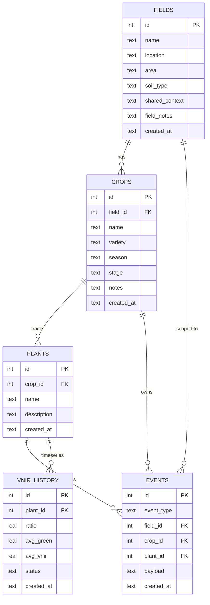
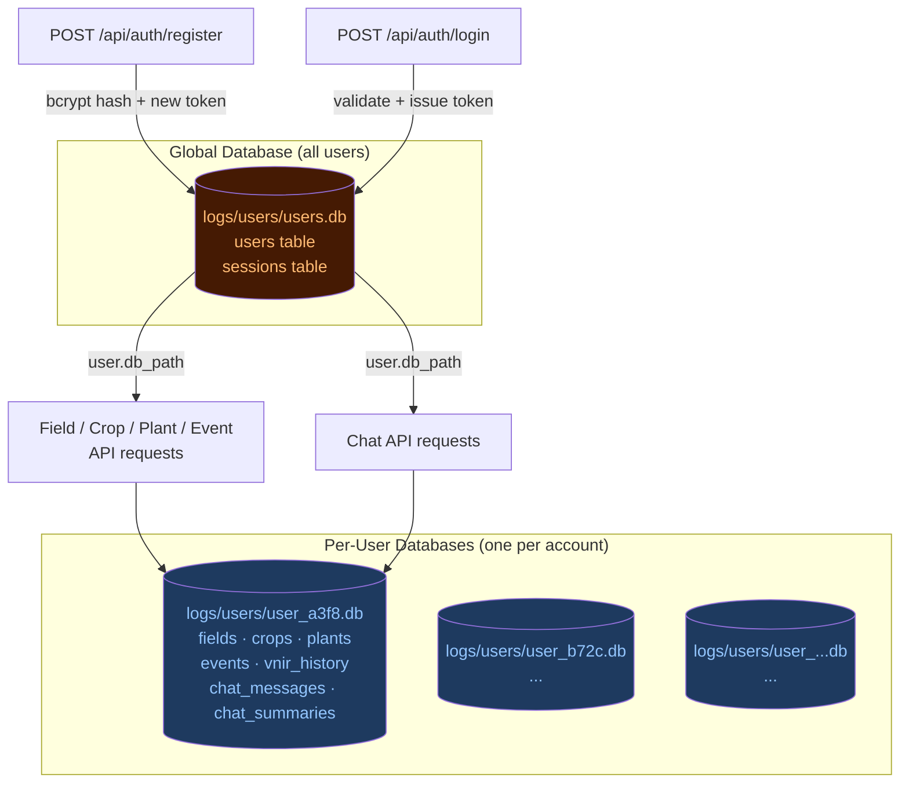

# Shared — Configuration, Schemas, Storage & Utilities

> **Module role:** The foundation layer. Shared provides the cross-cutting infrastructure that all other modules depend on: centralised configuration, validated API contracts, database abstractions, and reusable utility functions.

---

## 1. What is the Shared Module?

The `shared` module has no business logic of its own. It is the platform on which Gathi, Mizhi, Mozhi, and Yukthi are built. Every module imports from `shared` — it is never the other way around. This unidirectional dependency keeps the architecture clean and the modules independently testable.

---

## 2. File Structure

```
nava_core/shared/
├── __init__.py
├── config/
│   ├── __init__.py
│   └── settings.py      ← Settings dataclass + get_settings() singleton
├── schemas/
│   ├── __init__.py      ← Re-exports all schemas
│   ├── auth.py          ← Auth request/response schemas
│   ├── chat.py          ← Chat request/response schemas
│   ├── diagnose.py      ← Diagnose and VNIR response schemas
│   ├── events.py        ← Event list response schemas
│   └── fields.py        ← Field, crop, plant schemas
├── storage/
│   ├── __init__.py
│   ├── user_store.py    ← UserStore: global user registry + session management
│   └── field_store.py   ← FieldStore: per-user farm hierarchy + event log
└── utils/
    ├── __init__.py
    ├── image.py         ← PIL Image ↔ base64 conversion
    ├── logging.py       ← Standardised logger factory
    └── paths.py         ← Project root + models/logs directory resolution
```

---

## 3. Configuration (`config/settings.py`)

### High-Level Shared Module Overview

The Shared module is a purely infrastructure layer — it has no business logic and owns no domain. All other modules import from it; it never imports from them.

```mermaid
flowchart TD
    subgraph Shared["Shared — Foundation"]
        direction LR
        Config["Settings\n(frozen dataclass)"]
        Schemas["Pydantic Schemas\n(API contracts)"]
        UserDB["UserStore\n(global users.db)"]
        FarmDB["FieldStore\n(per-user farm.db)"]
        Utils["Utilities\n(image · logging · paths)"]
    end

    Gathi(["Gathi"])
    Mizhi(["Mizhi"])
    Mozhi(["Mozhi"])
    Yukthi(["Yukthi"])

    Gathi --> Config
    Gathi --> Schemas
    Gathi --> UserDB
    Gathi --> FarmDB
    Mizhi --> Config
    Mizhi --> Utils
    Mozhi --> FarmDB
    Mozhi --> Config
    Yukthi --> Config

    style Shared fill:#1a0a0a,stroke:#ef4444,stroke-width:2px
```



### Two-Database Architecture Overview

A key design decision is the strict separation between the **global user registry** (one file for all users) and **per-user farm databases** (one file per registered user).

```mermaid
flowchart LR
    User(["Authenticated\nUser"])
    Token["Bearer Token"]

    subgraph Global["Global (shared) "]
        GDB[("users.db\nusers + sessions")]
    end

    subgraph PerUser["Per-User (isolated)"]
        FDB[("user_{hash}.db\nfields · crops · plants\nevents · vnir_history\nchat sessions")]
    end

    User --> Token --> GDB
    GDB -- "db_path" --> FDB

    style Global fill:#451a03,stroke:#fdba74
    style PerUser fill:#1e3a5f,stroke:#93c5fd
```



### 3.1 The `Settings` Dataclass

All configuration is centralised in a single frozen dataclass:

```python
@dataclass(frozen=True)
class Settings:
    # ── Mizhi: disease detection ─────────────────────────
    efficientnet_model_path: Path
    efficientnet_labels_path: Path
    torch_device: str
    confidence_threshold: float

    # ── Mizhi: VNIR ───────────────────────────────────────
    vnir_model_path: Path
    vnir_stress_threshold_pct: float

    # ── Mozhi: LLM ────────────────────────────────────────
    hf_api_key: str
    hf_model: str
    hf_router_url: str
    hf_timeout_seconds: int
    hf_temperature: float
    hf_max_new_tokens: int
    hf_summary_model: str
    hf_summary_temperature: float
    hf_summary_max_new_tokens: int

    # ── Mozhi: memory ─────────────────────────────────────
    mozhi_max_history: int
    mozhi_summary_batch: int
    mozhi_summary_rollup: int

    # ── Auth ──────────────────────────────────────────────
    session_ttl_hours: int

    # ── Storage ───────────────────────────────────────────
    users_db_path: Path

    # ── Yukthi: RAG ───────────────────────────────────────
    yukthi_enabled: bool
    yukthi_chroma_dir: Path
    yukthi_source_dir: Path
    yukthi_top_k: int
    yukthi_distance_threshold: float
    yukthi_embed_model: str
```

The `frozen=True` attribute makes the dataclass immutable after construction — settings cannot be accidentally mutated at runtime.

### 3.2 Environment Variable Mapping

Every field maps to an environment variable with a sensible default:

| Setting Field | Environment Variable | Default |
|-------------|---------------------|---------|
| `efficientnet_model_path` | `NAVA_EFFICIENTNET_PATH` | `models/EfficientNet-B0.pth` |
| `efficientnet_labels_path` | `NAVA_EFFICIENTNET_LABELS` | `models/EfficientNet-B0-labels.txt` |
| `torch_device` | `NAVA_TORCH_DEVICE` | `cpu` |
| `confidence_threshold` | `NAVA_CONFIDENCE_THRESHOLD` | `0.8` |
| `vnir_model_path` | `NAVA_VNIR_PATH` | `models/ThanalModel.onnx` |
| `vnir_stress_threshold_pct` | `NAVA_STRESS_THRESHOLD` | `15.0` |
| `hf_api_key` | `HF_API_KEY` | *(required)* |
| `hf_model` | `HF_MODEL` | `meta-llama/Meta-Llama-3-70B-Instruct:novita` |
| `hf_router_url` | `HF_ROUTER_CHAT_URL` | `https://router.huggingface.co/v1/chat/completions` |
| `hf_timeout_seconds` | `HF_TIMEOUT` | `30` |
| `hf_temperature` | `HF_TEMPERATURE` | `0.4` |
| `hf_max_new_tokens` | `HF_MAX_NEW_TOKENS` | `400` |
| `hf_summary_model` | `HF_SUMMARY_MODEL` | `meta-llama/Llama-3.1-8B-Instruct:novita` |
| `mozhi_max_history` | `NAVA_MOZHI_MAX_HISTORY` | `20` |
| `mozhi_summary_batch` | `NAVA_MOZHI_SUMMARY_BATCH` | `14` |
| `mozhi_summary_rollup` | `NAVA_MOZHI_SUMMARY_ROLLUP` | `5` |
| `session_ttl_hours` | `NAVA_SESSION_TTL_HOURS` | `168` (7 days) |
| `users_db_path` | `NAVA_USERS_DB` | `logs/users/users.db` |
| `yukthi_enabled` | `NAVA_YUKTHI_ENABLED` | `true` |
| `yukthi_chroma_dir` | `NAVA_YUKTHI_CHROMA_DIR` | `logs/chroma` |
| `yukthi_source_dir` | `NAVA_YUKTHI_SOURCE_DIR` | `ragsource/` |
| `yukthi_top_k` | `NAVA_YUKTHI_TOP_K` | `3` |
| `yukthi_distance_threshold` | `NAVA_YUKTHI_DISTANCE_THRESHOLD` | `0.45` |
| `yukthi_embed_model` | `NAVA_YUKTHI_EMBED_MODEL` | `BAAI/bge-small-en-v1.5` |

### 3.3 `get_settings()` — The Singleton Pattern

```python
@lru_cache
def get_settings() -> Settings:
    ...
```

`@lru_cache` with no arguments creates a singleton: the first call constructs and caches the `Settings` object; every subsequent call returns the cached instance immediately. This means:
- Environment variables are read exactly once at first access
- All modules share the same `Settings` instance
- The settings object never changes at runtime

The settings module also performs a one-time side effect: it propagates `HF_API_KEY` as `HF_TOKEN` and `HUGGING_FACE_HUB_TOKEN` environment variables. This ensures `sentence-transformers` and the Hugging Face Hub client use authenticated requests when downloading the embedding model, avoiding rate-limit errors on model download.

---

## 4. Pydantic Schemas (`schemas/`)

All API request and response bodies are defined as Pydantic v2 models. These serve as the contract between the FastAPI backend and the React frontend.

### 4.1 Auth Schemas (`schemas/auth.py`)

| Schema | Direction | Fields |
|--------|-----------|--------|
| `AuthRegisterRequest` | Frontend → Backend | `name`, `email`, `password` |
| `AuthLoginRequest` | Frontend → Backend | `email`, `password` |
| `AuthResponse` | Backend → Frontend | `token`, `user: UserResponse` |
| `UserResponse` | Backend → Frontend | `id`, `name`, `email`, `onboarded`, `location`, `goals`, `created_at` |
| `UpdateUserRequest` | Frontend → Backend | `name` |
| `UpdatePasswordRequest` | Frontend → Backend | `current_password`, `new_password` |

### 4.2 Chat Schemas (`schemas/chat.py`)

| Schema | Fields |
|--------|--------|
| `ChatRequest` | `message`, `session_id`, `field_id?`, `crop_id?` |
| `ChatResponse` | `session_id`, `reply`, `rag_used`, `rag_chunk_count`, `rag_chunks: list[dict]` |
| `ChatHistoryRequest` | `session_id` |
| `ChatHistoryResponse` | `messages: list[ChatHistoryMessage]` |
| `ChatHistoryMessage` | `role`, `content`, `created_at`, `metadata?` |
| `ChatSummaryRequest` | `session_id` |
| `ChatSummaryResponse` | `summary: str \| None` |
| `ChatClearRequest` | `session_id` |
| `ChatClearResponse` | `status` |

### 4.3 Diagnose Schemas (`schemas/diagnose.py`)

| Schema | Fields |
|--------|--------|
| `DiagnoseResponse` | `class_label`, `class_index`, `confidence`, `reliability`, `original_image_base64?`, `gradcam_image_base64?` |
| `VNIRResponse` | `plant_id`, `leaf_state`, `status`, `avg_green`, `avg_vnir`, `ratio`, `baseline`, `rolling_avg`, `prev_checkpoint_avg`, `global_avg`, `vs_baseline`, `vs_global`, `vs_rolling`, `vs_prev_checkpoint`, `hsv_image_base64`, `vnir_image_base64` |
| `VNIRPlantsResponse` | `plants: list[dict]` |

### 4.4 Field/Crop/Plant Schemas (`schemas/fields.py`)

| Schema | Direction | Key Fields |
|--------|-----------|------------|
| `FieldCreateRequest` | Frontend → Backend | `name`, `location?`, `area?`, `soil_type?`, `shared_context?` |
| `FieldUpdateRequest` | Frontend → Backend | `field_id`, `name?`, `location?`, `area?`, `soil_type?` |
| `FieldResponse` | Backend → Frontend | `id`, `name`, `location`, `area`, `soil_type`, `shared_context`, `field_notes`, `created_at` |
| `FieldListResponse` | Backend → Frontend | `fields: list[FieldResponse]` |
| `FieldContextRequest` | Frontend → Backend | `field_id`, `shared_context` |
| `CropCreateRequest` | Frontend → Backend | `field_id`, `name`, `variety?`, `season?`, `stage?`, `notes?` |
| `CropResponse` | Backend → Frontend | `id`, `field_id`, `name`, `variety`, `season`, `stage`, `notes`, `created_at` |
| `PlantCreateRequest` | Frontend → Backend | `crop_id`, `name`, `description?` |
| `PlantResponse` | Backend → Frontend | `id`, `crop_id`, `name`, `description`, `created_at` |

---

## 5. User Storage (`storage/user_store.py`)

`UserStore` manages the global user registry in a single SQLite file shared across all users.

### 5.1 Database Schema

```sql
CREATE TABLE users (
    id         INTEGER PRIMARY KEY AUTOINCREMENT,
    name       TEXT NOT NULL,
    email      TEXT NOT NULL UNIQUE,
    password   TEXT NOT NULL,          -- bcrypt hash
    db_path    TEXT NOT NULL,          -- path to this user's per-user farm DB
    onboarded  INTEGER DEFAULT 0,
    location   TEXT,
    goals      TEXT,
    created_at TEXT DEFAULT CURRENT_TIMESTAMP
);

CREATE TABLE sessions (
    id         INTEGER PRIMARY KEY AUTOINCREMENT,
    user_id    INTEGER NOT NULL,
    token      TEXT NOT NULL UNIQUE,   -- 32-byte hex random string
    expires_at TEXT,                   -- NULL = no expiry
    created_at TEXT DEFAULT CURRENT_TIMESTAMP,
    FOREIGN KEY (user_id) REFERENCES users(id)
);
```

### 5.2 Key Operations

**User creation:**
```python
def create_user(self, name, email, password) -> UserRecord:
    hashed = bcrypt.hashpw(password.encode(), bcrypt.gensalt()).decode()
    db_path = logs_dir() / "users" / f"user_{email_hash}.db"
    # INSERT INTO users ...
```
The per-user farm database path is derived from a hash of the email, ensuring uniqueness and privacy (the path does not expose the email directly).

**Authentication:**
```python
def authenticate(self, email, password) -> UserRecord | None:
    user = self._get_by_email(email)
    if not user: return None
    if bcrypt.checkpw(password.encode(), user.password.encode()):
        return user
    return None
```

**Session management:**
- `create_session(user_id)` generates a `secrets.token_hex(32)` token and inserts it with an expiry timestamp (`now + session_ttl_hours`).
- `get_user_by_token(token)` validates the token, checks expiry, and returns the `UserRecord` if valid.
- `session_ttl_hours = 0` disables expiry.

**Account deletion:**
`delete_user(user_id)` removes the user record, all their sessions, and (if the file exists) the per-user farm SQLite database file from disk. This is a full cascading delete.

### 5.3 `UserRecord` Dataclass

```python
@dataclass
class UserRecord:
    id: int
    name: str
    email: str
    password: str      # bcrypt hash (never sent to frontend)
    db_path: str       # path to per-user farm database
    onboarded: bool
    location: str | None
    goals: str | None
    created_at: str
```

---

## 6. Field Store (`storage/field_store.py`)

`FieldStore` is the most complex storage class in NAVA. It manages the complete farm hierarchy for a single user: fields → crops → plants → events + VNIR history.

Each `FieldStore` instance is constructed per-request with the user's specific database path:
```python
def field_store_for_user(user: UserRecord) -> FieldStore:
    return FieldStore(Path(user.db_path))
```

### 6.1 Database Schema

```sql
CREATE TABLE fields (
    id             INTEGER PRIMARY KEY AUTOINCREMENT,
    name           TEXT NOT NULL,
    location       TEXT,
    area           TEXT,
    soil_type      TEXT,
    shared_context TEXT,     -- auto-generated context for the LLM (hidden from UI)
    field_notes    TEXT,     -- manually written notes (shown in UI)
    created_at     TEXT DEFAULT CURRENT_TIMESTAMP
);

CREATE TABLE crops (
    id         INTEGER PRIMARY KEY AUTOINCREMENT,
    field_id   INTEGER NOT NULL,
    name       TEXT NOT NULL,
    variety    TEXT,
    season     TEXT,
    stage      TEXT,
    notes      TEXT,         -- manual notes + NAVA auto-notes below separator
    created_at TEXT DEFAULT CURRENT_TIMESTAMP,
    FOREIGN KEY (field_id) REFERENCES fields(id)
);

CREATE TABLE plants (
    id          INTEGER PRIMARY KEY AUTOINCREMENT,
    crop_id     INTEGER NOT NULL,
    name        TEXT NOT NULL,
    description TEXT,
    created_at  TEXT DEFAULT CURRENT_TIMESTAMP,
    FOREIGN KEY (crop_id) REFERENCES crops(id),
    UNIQUE(crop_id, name)    -- plant names must be unique within a crop
);

CREATE TABLE events (
    id         INTEGER PRIMARY KEY AUTOINCREMENT,
    event_type TEXT NOT NULL,  -- 'diagnose' or 'vnir'
    field_id   INTEGER,
    crop_id    INTEGER,
    plant_id   INTEGER,
    payload    TEXT,           -- JSON blob with scan results
    created_at TEXT DEFAULT CURRENT_TIMESTAMP,
    FOREIGN KEY (field_id)  REFERENCES fields(id),
    FOREIGN KEY (crop_id)   REFERENCES crops(id),
    FOREIGN KEY (plant_id)  REFERENCES plants(id)
);

CREATE TABLE vnir_history (
    id         INTEGER PRIMARY KEY AUTOINCREMENT,
    plant_id   INTEGER NOT NULL,
    ratio      REAL NOT NULL,   -- NIR/Green ratio for this scan
    avg_green  REAL,
    avg_vnir   REAL,
    status     TEXT,
    created_at TEXT DEFAULT CURRENT_TIMESTAMP,
    FOREIGN KEY (plant_id) REFERENCES plants(id)
);
```

### Farm Data Entity-Relationship Diagram



### 6.2 Two Storage Layers for VNIR Data

VNIR data is intentionally stored in two tables:

- **`events`** — stores the full event payload (status, ratio, leaf_state, all delta comparisons, etc.) as a JSON blob. Used for the activity feed, history display, and context generation.
- **`vnir_history`** — stores only the scalar `ratio` values as a lightweight timeseries. Used by `VNIRAnalyzer.analyze()` to compute rolling averages and checkpoint comparisons. This avoids parsing JSON on every scan.

### 6.3 Auto-Generated Field Context

`auto_generate_field_context(field_id)` builds a structured text block from live database content:

```
Location: Wayanad, Kerala
Size: 2 acres
Soil type: Laterite

Active crops (2):
  • Banana (Nendran) [Vegetative] — last disease: banana_black_sigatoka (87%)  — VNIR: WARNING: Stress detected
  • Rice (Jyothi) [Flowering]
```

This text is stored in `fields.shared_context` and is injected into the LLM prompt as field-level context. It is regenerated automatically after every mutation (new crop, updated event, deleted plant) via `_refresh_field_context()` calls in the field router.

### 6.4 Rich Crop Context

`get_rich_crop_context(crop_id)` generates a more detailed multi-section block for crop-level chat:

```
=== FIELD: North Paddock ===
Location: Wayanad, Kerala
Size: 2 acres
Soil type: Laterite

All crops in this field (2):
► (CURRENT) Banana (Nendran) [Vegetative]
   Rice (Jyothi) [Flowering]
      Plant 'Plant-1': Disease=rice_blast | VNIR=Calibrating

=== CURRENT CROP: Banana ===
Variety: Nendran
Growth stage: Vegetative
Season: Kharif 2026
Crop notes: Applied bordeaux mixture on 2026-05-20
--- NAVA Auto-notes ---
[2026-05-21 14:30]
- Applied Carbendazim fungicide at 1g/L concentration

PRIORITY RULES:
  - Disease detection results have HIGHER priority than stress monitoring.
  ...

=== PLANT MONITORING (2 plants) ===

  Plant 'Plant-1': — Left corner tree
    [HIGH PRIORITY] Disease Detection History:
      [2026-05-20] banana_black_sigatoka (87% confidence) — RELIABLE
    [LOWER PRIORITY] Stress Monitoring (VNIR — precautionary):
      [2026-05-21] WARNING: Stress detected ratio=0.7823
```

The priority rules section explicitly guides the LLM to treat disease detection results as more actionable than VNIR stress signals (which are proactive and precautionary).

### 6.5 Schema Migration

`_migrate_schema()` handles incremental non-destructive schema changes for existing databases:

```python
def _migrate_schema(self, conn):
    # Migration 1: Add plant_id to events table
    event_cols = {row[1] for row in conn.execute("PRAGMA table_info(events)")}
    if "plant_id" not in event_cols:
        conn.execute("ALTER TABLE events ADD COLUMN plant_id INTEGER REFERENCES plants(id)")
    
    # Migration 2: Add field_notes to fields table
    field_cols = {row[1] for row in conn.execute("PRAGMA table_info(fields)")}
    if "field_notes" not in field_cols:
        conn.execute("ALTER TABLE fields ADD COLUMN field_notes TEXT")
    
    # Migration 3: Handle vnir_history with old TEXT plant_id column
    vh_cols = {row[1]: row[2] for row in conn.execute("PRAGMA table_info(vnir_history)")}
    if not vh_cols:
        # Create fresh
        conn.execute("CREATE TABLE IF NOT EXISTS vnir_history (...)")
    elif vh_cols.get("plant_id", "").upper() == "TEXT":
        # Old incompatible schema — recreate (data loss acceptable, old format was broken)
        conn.executescript("ALTER TABLE vnir_history RENAME TO vnir_history_old; CREATE TABLE vnir_history (...);")
```

This approach ensures databases created by older versions of the application are upgraded transparently the next time they are opened, without requiring a manual migration step.

---

## 7. Utilities (`utils/`)

### 7.1 Path Resolution (`utils/paths.py`)

```python
def project_root() -> Path:
    """Traverse up from this file to find the NAVA-AG project root."""
    return Path(__file__).resolve().parents[3]

def models_dir() -> Path:
    return project_root() / "models"

def logs_dir() -> Path:
    return project_root() / "logs"
```

All path references throughout the codebase use these functions rather than hardcoded strings. This makes the project relocatable — it can be placed anywhere on the filesystem.

### 7.2 Image Utilities (`utils/image.py`)

```python
def image_to_base64(image: Image.Image) -> str:
    """Convert PIL Image to data URI string for JSON transport."""
    buffer = io.BytesIO()
    image.save(buffer, format="PNG")
    return "data:image/png;base64," + base64.b64encode(buffer.getvalue()).decode()

def load_image_from_bytes(data: bytes) -> Image.Image:
    """Load PIL Image from raw bytes (from multipart upload)."""
    return Image.open(io.BytesIO(data))
```

These are used by both the diagnose and VNIR routers to convert ML model outputs (PIL Images) into base64-encoded data URIs that can be embedded directly in JSON responses and rendered by the React frontend as ``.

### 7.3 Logging (`utils/logging.py`)

```python
def get_logger(name: str) -> logging.Logger:
    """Return a named logger with standardised formatting."""
    logger = logging.getLogger(name)
    if not logger.handlers:
        handler = logging.StreamHandler()
        handler.setFormatter(logging.Formatter(
            "%(asctime)s [%(name)s] %(levelname)s: %(message)s"
        ))
        logger.addHandler(handler)
    return logger
```

All module-level loggers follow the `nava.{module}.{submodule}` naming convention (e.g., `nava.mizhi.detection`, `nava.yukthi.retriever`). This allows selective log filtering in production.

---

## 8. The Two-Database Architecture

A key architectural decision in NAVA is the separation of user identity from farm data:

| Database | Path | Content | Scope |
|----------|------|---------|-------|
| `users.db` | `logs/users/users.db` | User accounts, session tokens | Global (all users) |
| `user_{hash}.db` | `logs/users/user_{hash}.db` | Fields, crops, plants, events, VNIR history, chat sessions | Per-user |

**Why this separation?**

1. **Security isolation:** A bug that exposes one user's database cannot expose another user's farm data or credentials.
2. **Scalability:** Per-user databases can be archived, backed up, or migrated independently.
3. **Privacy:** Deleting an account deletes only the relevant per-user file — no complex SQL cascade across a shared table.
4. **Simplicity:** SQLite's write-ahead logging (WAL mode, enabled with `PRAGMA journal_mode=WAL`) handles concurrent reads efficiently without a separate database server.

### Two-Database Architecture (Detailed)


