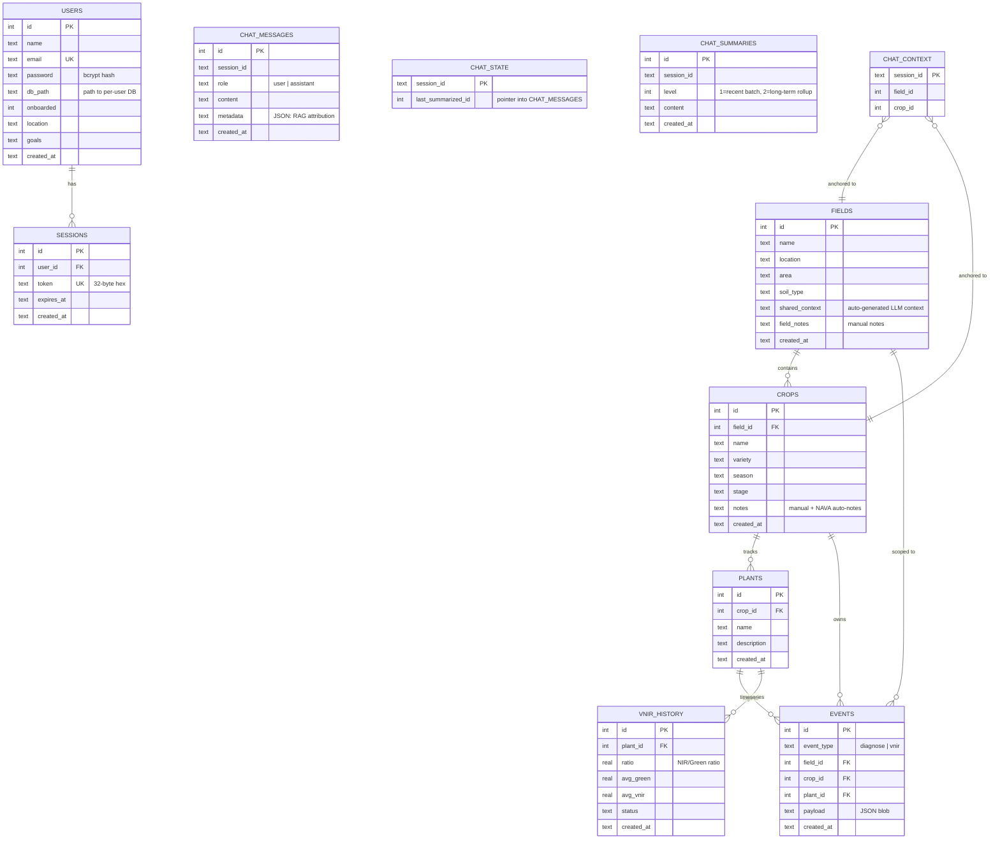

# Data Storage, Schemas & Data Flow

> A complete reference for all persistent data in NAVA: what is stored, how it is organised, where it lives, how it is written, and how it is read back.

---

## 1. Storage Backend Overview

NAVA uses three distinct storage systems, each chosen for a specific purpose:

| Backend | Technology | Location | Purpose |
|---------|-----------|----------|---------|
| **User Registry** | SQLite | `logs/users/users.db` | User accounts, passwords, session tokens |
| **Farm Data** | SQLite (per-user) | `logs/users/user_{hash}.db` | Fields, crops, plants, events, VNIR history, chat sessions |
| **Vector Knowledge Base** | ChromaDB (persistent) | `logs/chroma/` | Agricultural document embeddings for RAG retrieval |

There are no external databases, no Redis, no PostgreSQL. The system is designed to be self-contained: a single directory structure contains everything needed to run NAVA from scratch.

Model files are not a database, but they are essential runtime artifacts:
- `models/EfficientNet-B0.pth` — PyTorch checkpoint (~20 MB)
- `models/EfficientNet-B0-labels.txt` — 34 class label strings
- `models/ThanalModel.onnx` — ONNX VNIR model

---

## 2. Full-System Entity-Relationship Diagram

The diagram below covers all persistent tables across both the global user database and the per-user farm/chat database, using visual grouping to clarify which database each table lives in.



> **Database boundary:** `USERS` and `SESSIONS` live in `logs/users/users.db`. All remaining tables live in `logs/users/user_{hash}.db` — one file per registered user. Chat tables (`CHAT_*`) are managed by `SessionStore` but share the per-user database file.

---

## 3. Table-by-Table Schema Reference

### 3.1 `users` (global `users.db`)

| Column | Type | Constraints | Description |
|--------|------|-------------|-------------|
| `id` | INTEGER | PK, AUTOINCREMENT | Internal user identifier |
| `name` | TEXT | NOT NULL | Display name |
| `email` | TEXT | NOT NULL, UNIQUE | Login credential, used as lookup key |
| `password` | TEXT | NOT NULL | bcrypt hash (never returned to client) |
| `db_path` | TEXT | NOT NULL | Absolute filesystem path to the user's per-user SQLite database |
| `onboarded` | INTEGER | DEFAULT 0 | 1 if the user has completed the onboarding flow |
| `location` | TEXT | — | User-provided location (optional) |
| `goals` | TEXT | — | User-provided farming goals (optional) |
| `created_at` | TEXT | DEFAULT CURRENT_TIMESTAMP | ISO 8601 UTC timestamp |

**Notes:**
- Email uniqueness is enforced at the database level (`UNIQUE` constraint). The register endpoint wraps the INSERT in a `try/except sqlite3.IntegrityError` to return a clean 400 HTTP error.
- The `db_path` is derived from a hash of the email at registration time and never changes, even if the user's name is updated.

### 3.2 `sessions` (global `users.db`)

| Column | Type | Constraints | Description |
|--------|------|-------------|-------------|
| `id` | INTEGER | PK, AUTOINCREMENT | Internal session ID |
| `user_id` | INTEGER | FK → users.id | The owner |
| `token` | TEXT | NOT NULL, UNIQUE | 32-byte hex random string (64 hex characters) |
| `expires_at` | TEXT | — | ISO 8601 UTC timestamp; NULL = no expiry |
| `created_at` | TEXT | DEFAULT CURRENT_TIMESTAMP | Session creation time |

**Token lifecycle:**
1. Created at `/api/auth/login` or `/api/auth/register` via `secrets.token_hex(32)`.
2. Validated on every authenticated request by `require_user(authorization)` dependency.
3. Expiry is checked: `expires_at IS NULL OR expires_at > now()`.
4. Deleted implicitly when the user account is deleted (CASCADE via application logic, not FK).

### 3.3 `fields` (per-user DB)

| Column | Type | Description |
|--------|------|-------------|
| `id` | INTEGER PK | Internal field ID |
| `name` | TEXT | Field display name (e.g., "North Paddock") |
| `location` | TEXT | Geographic location (e.g., "Wayanad, Kerala") |
| `area` | TEXT | Free-form size description (e.g., "2 acres") |
| `soil_type` | TEXT | One of 14 predefined soil types or custom |
| `shared_context` | TEXT | **Auto-generated** by `auto_generate_field_context()` — never directly edited by the user via API; fed into the LLM system prompt |
| `field_notes` | TEXT | **Manually written** field-level observations; shown in the UI; prepended to `shared_context` when building LLM context |
| `created_at` | TEXT | ISO 8601 UTC timestamp |

**`shared_context` vs. `field_notes`:**
This distinction is important. `shared_context` is machine-generated from the live database state (crop names, stages, health statuses). The user never edits it directly — it is always fresh and always reflects current farm state. `field_notes` is human-written and is preserved exactly as typed.

### 3.4 `crops` (per-user DB)

| Column | Type | Description |
|--------|------|-------------|
| `id` | INTEGER PK | Internal crop ID |
| `field_id` | INTEGER FK | Parent field |
| `name` | TEXT | Crop species name (e.g., "Banana") |
| `variety` | TEXT | Cultivar/variety (e.g., "Nendran") |
| `season` | TEXT | Growing season (e.g., "Kharif 2026") |
| `stage` | TEXT | Growth stage (Seedling / Vegetative / Flowering / Fruiting / Maturity / Harvested) |
| `notes` | TEXT | Manual notes + `--- NAVA Auto-notes ---` separator + LLM-extracted auto-notes |
| `created_at` | TEXT | ISO 8601 UTC timestamp |

**`notes` field structure:**
```
User-written notes about irrigation and fertilization schedule.

--- NAVA Auto-notes ---
[2026-05-21 14:30 UTC]
- Applied Carbendazim 1g/L on Plant-1 as per NAVA recommendation
[2026-05-24 09:15 UTC]
- Initiated drip irrigation after VNIR stress warning
```
The `--- NAVA Auto-notes ---` separator is used by the frontend's `splitNotes()` utility to display manual notes and auto-notes separately in the UI, with distinct styling.

### 3.5 `plants` (per-user DB)

| Column | Type | Description |
|--------|------|-------------|
| `id` | INTEGER PK | Internal plant ID |
| `crop_id` | INTEGER FK | Parent crop |
| `name` | TEXT | Plant identifier (e.g., "Plant-1", "Left tree") |
| `description` | TEXT | Optional physical description or location note |
| `created_at` | TEXT | ISO 8601 UTC timestamp |

**Uniqueness:** `UNIQUE(crop_id, name)` ensures no two plants in the same crop share a name. The create endpoint returns `-1` (checked by the router) if this constraint is violated.

### 3.6 `events` (per-user DB)

| Column | Type | Description |
|--------|------|-------------|
| `id` | INTEGER PK | Internal event ID |
| `event_type` | TEXT | `'diagnose'` or `'vnir'` |
| `field_id` | INTEGER FK | Parent field (can be NULL for very early events) |
| `crop_id` | INTEGER FK | Parent crop (can be NULL) |
| `plant_id` | INTEGER FK | Parent plant |
| `payload` | TEXT | JSON blob — event type-specific content (see below) |
| `created_at` | TEXT | ISO 8601 UTC timestamp |

**`diagnose` event payload:**
```json
{
  "plant_name": "Plant-1",
  "class_label": "banana_black_sigatoka",
  "class_index": 3,
  "confidence": 0.8732,
  "reliability": "RELIABLE"
}
```

**`vnir` event payload:**
```json
{
  "plant_name": "Plant-1",
  "status": "WARNING: Stress detected",
  "leaf_state": "GREEN",
  "ratio": 0.7823,
  "vs_baseline": -18.3,
  "vs_global": -15.1,
  "vs_rolling": -12.5,
  "vs_prev_checkpoint": -19.7
}
```

### 3.7 `vnir_history` (per-user DB)

| Column | Type | Description |
|--------|------|-------------|
| `id` | INTEGER PK | Internal reading ID |
| `plant_id` | INTEGER FK | Parent plant |
| `ratio` | REAL | NIR/Green ratio for this scan |
| `avg_green` | REAL | Mean green channel intensity over leaf mask |
| `avg_vnir` | REAL | Mean estimated NIR intensity over leaf mask |
| `status` | TEXT | Status string at time of scan |
| `created_at` | TEXT | ISO 8601 UTC timestamp |

**Why both `events` and `vnir_history`?**
- `events` stores the full JSON payload for display in the activity feed and context generation.
- `vnir_history` stores just the scalar ratio for efficient timeseries analysis. `get_vnir_ratios(plant_id)` returns `[r1, r2, r3, ...]` directly — no JSON parsing needed.

### 3.8 `chat_messages` (per-user DB)

| Column | Type | Description |
|--------|------|-------------|
| `id` | INTEGER PK | Internal message ID (used for `last_summarized_id` tracking) |
| `session_id` | TEXT | UUID hex string (client-generated) |
| `role` | TEXT | `'user'` or `'assistant'` |
| `content` | TEXT | Full message text |
| `metadata` | TEXT | JSON blob for RAG attribution (see below) |
| `created_at` | TEXT | ISO 8601 UTC timestamp |

**`metadata` JSON structure (assistant messages only):**
```json
{
  "rag_used": true,
  "rag_chunk_count": 3,
  "rag_chunks": [
    {"source": "banana_diseases.txt", "section": "Black Sigatoka Management", "snippet": "Apply copper-based fungicides..."},
    {"source": "management_guide.pdf", "section": "Fungicide Schedule", "snippet": "Rotate between triazole and..."},
    {"source": "kerala_kau_practices.pdf", "section": "Banana KAU Package", "snippet": "Recommended dosage for..."}
  ]
}
```

### 3.9 `chat_state` (per-user DB)

| Column | Type | Description |
|--------|------|-------------|
| `session_id` | TEXT PK | UUID hex string |
| `last_summarized_id` | INTEGER | The highest `chat_messages.id` that has been included in a summary; messages with ID > this are "recent" |

### 3.10 `chat_summaries` (per-user DB)

| Column | Type | Description |
|--------|------|-------------|
| `id` | INTEGER PK | Summary ID |
| `session_id` | TEXT | Parent session |
| `level` | INTEGER | 1 = recent batch summary, 2 = long-term rollup of multiple level-1 summaries |
| `content` | TEXT | Summary text in bullet format |
| `created_at` | TEXT | ISO 8601 UTC timestamp |

### 3.11 `chat_context` (per-user DB)

| Column | Type | Description |
|--------|------|-------------|
| `session_id` | TEXT PK | UUID hex string |
| `field_id` | INTEGER | Field this session is anchored to |
| `crop_id` | INTEGER | Crop this session is anchored to |

This table allows the session to remember which crop it was started for, so the user doesn't need to specify it on every chat request.

---

## 4. ChromaDB Structure

### 4.1 Collection Organisation

Each crop supported by NAVA has its own ChromaDB collection:

| Collection Name | Content |
|----------------|---------|
| `nava_banana` | Banana disease management documents |
| `nava_rice` | Rice disease and cultivation documents |
| `nava_tomato` | Tomato disease documents |
| `nava_corn` | Corn/Maize documents |
| `nava_soybean` | Soybean documents |
| `nava_cassava` | Cassava documents |
| `nava_cucumber` | Cucumber documents |

### 4.2 Document Schema

Each ChromaDB entry contains:

| Field | Type | Content |
|-------|------|---------|
| `id` | string | `"{source_filename}_{chunk_index}"` — deterministic, unique |
| `document` | string | Raw text of the chunk |
| `embedding` | float[384] | BAAI/bge-small-en-v1.5 dense vector |
| `metadata.crop` | string | Crop name |
| `metadata.source` | string | Source filename |
| `metadata.section` | string | Detected section header or `"General"` |
| `metadata.chunk_index` | int | Zero-based index within the source file |

### 4.3 Query Interface

```python
# Standard semantic search:
collection.query(query_embeddings=[embedding], n_results=5)

# Keyword-filtered semantic search:
collection.query(
    query_embeddings=[embedding],
    n_results=3,
    where_document={"$contains": "Sigatoka"}
)
```

The `where_document` filter is applied before the vector similarity computation, restricting the search space to chunks that literally contain the specified term.

---

## 5. Data Write Paths

### 5.1 User Registration
```
POST /api/auth/register
    → UserStore.create_user(name, email, password)
        → bcrypt.hashpw(password)
        → derive db_path from email hash
        → INSERT INTO users (name, email, password, db_path)
        → UserStore.create_session(user.id)
            → secrets.token_hex(32)
            → INSERT INTO sessions (user_id, token, expires_at)
        → return AuthResponse(token, user)
```

### 5.2 Disease Scan
```
POST /api/diagnose (image, plant_id, crop_id, field_id)
    → EfficientNetB0Predictor.predict(image)
    → if RELIABLE: EfficientNetB0Predictor.predict_with_cam(image)
    → FieldStore.add_event(
          event_type="diagnose",
          field_id, crop_id, plant_id,
          payload={class_label, confidence, reliability, ...}
      )
        → INSERT INTO events (...)
    → FieldStore.auto_generate_field_context(field_id)
    → FieldStore.update_field_context(field_id, ctx)
        → UPDATE fields SET shared_context=? WHERE id=?
    → return DiagnoseResponse(class_label, confidence, images)
```

### 5.3 Chat Message
```
POST /api/chat (message, session_id, field_id, crop_id)
    → ChatService.chat(...)
        → SessionStore.set_session_context(session_id, field_id, crop_id)
        → SessionStore.fetch_messages(session_id, limit=20)
        → FieldStore.get_rich_crop_context(crop_id)
        → SessionStore.fetch_summaries(session_id)
        → QueryRouter.should_retrieve(message)
        → if True: RAGRetriever.query(enriched_query, crop)
        → ChatClient.send(assembled_messages)
        → SessionStore.append_message(session_id, "user", message)
        → SessionStore.append_message(session_id, "assistant", reply, metadata=rag_meta)
        → ChatService._summarize_if_needed(session_id)
            → (if needed) ChatClient.send(summary_prompt, model=small_model)
            → SessionStore.add_summary(session_id, level=1, content)
            → SessionStore.set_last_summarized_id(session_id, max_id)
        → return ChatResponse(reply, rag_used, rag_chunks)
```

---

## 6. Data Read Paths

### 6.1 Dashboard Load (Fields page)
```
GET /api/fields
    → FieldStore.list_fields()
        → SELECT * FROM fields

GET /api/crops?field_id={id}  (parallelised for all fields)
    → FieldStore.list_crops(field_id)
        → SELECT * FROM crops WHERE field_id=?

GET /api/events?limit=100
    → FieldStore.list_events(limit=100)
        → SELECT * FROM events ORDER BY created_at DESC LIMIT ?
```

### 6.2 LLM Context Assembly (per chat request)
```
FieldStore.get_rich_crop_context(crop_id)
    → SELECT * FROM fields WHERE id=? (to get field meta)
    → SELECT * FROM crops WHERE field_id=? (all sibling crops)
    → For each sibling crop:
        → SELECT * FROM events WHERE crop_id=? AND event_type='diagnose'
                         ORDER BY created_at DESC LIMIT 1
        → SELECT * FROM events WHERE crop_id=? AND event_type='vnir'
                         ORDER BY created_at DESC LIMIT 1
    → SELECT * FROM plants WHERE crop_id=?  (current crop's plants)
    → For each plant:
        → SELECT * FROM events WHERE plant_id=? AND event_type='diagnose'
                         ORDER BY created_at DESC LIMIT 5
        → SELECT * FROM events WHERE plant_id=? AND event_type='vnir'
                         ORDER BY created_at DESC LIMIT 5
    → Assemble multi-section text block → return as string
```

### 6.3 VNIR History Read (before each VNIR scan)
```
FieldStore.get_vnir_ratios(plant_id)
    → SELECT ratio FROM vnir_history WHERE plant_id=?
               ORDER BY created_at ASC
    → return [r1, r2, r3, ...]
```

---

## 7. Schema Migration Strategy

NAVA does not use a migration framework (like Alembic). Instead, non-destructive incremental migrations are applied in `FieldStore._migrate_schema()` using `PRAGMA table_info()` introspection:

```python
existing_columns = {row[1] for row in conn.execute("PRAGMA table_info(table_name)")}
if "new_column" not in existing_columns:
    conn.execute("ALTER TABLE table_name ADD COLUMN new_column TYPE DEFAULT NULL")
```

This approach is applied every time a `FieldStore` connection is opened. It is idempotent — running it on an already-migrated database is a no-op. `UserStore` follows the same pattern for the global user database.

The only migration that causes data loss is the `vnir_history` table recreation when an incompatible old schema (where `plant_id` was stored as `TEXT`) is detected. This was a one-time breaking schema change; all currently deployed databases are already on the correct schema.

---

## 8. Concurrency & Locking

**SQLite WAL mode:**
Both `UserStore` and `FieldStore` enable Write-Ahead Logging (`PRAGMA journal_mode=WAL`) on every connection. WAL allows simultaneous readers and a single writer, which is appropriate for NAVA's usage pattern (many concurrent reads during active sessions, sequential writes per user interaction).

**Connection lifetime:**
Every `FieldStore` and `SessionStore` method opens a fresh `sqlite3.connect()` call, performs the operation, and closes the connection. This avoids connection lifecycle issues in FastAPI's concurrent request handling but means there is no connection pooling. For the expected scale of a farm management application (10–100 concurrent users), this is adequate.

**Thread safety:**
SQLite's default mode (`check_same_thread=True`) is set to `False` for the UserStore, which may be accessed from multiple FastAPI worker threads. Since each request opens its own connection, there is no actual shared state between threads.
