# Frontend Views & UI Architecture

> A detailed walkthrough of every page, panel, and component in the NAVA React SPA — what it shows, how it works, and how it connects to the backend.

---

## 1. Design System

NAVA's frontend is styled with a single ~80 KB `styles.css` file that implements a bespoke dark-mode design system using CSS custom properties.

### 1.1 Design Tokens

```css
:root {
  /* Backgrounds */
  --bg-primary:    #0a0f0a;   /* deepest dark green-black */
  --bg-secondary:  #111711;   /* card backgrounds */
  --bg-glass:      rgba(16, 24, 16, 0.7);

  /* Accent colours */
  --green-400:     #34d399;
  --green-500:     #10b981;
  --red-400:       #f87171;
  --red-500:       #ef4444;
  --red-600:       #dc2626;
  --blue-400:      #60a5fa;

  /* Text */
  --text-primary:   #e2e8f0;
  --text-secondary: #94a3b8;
  --text-muted:     #64748b;

  /* Borders */
  --border-default: rgba(255, 255, 255, 0.08);
}
```

The green accent palette is intentional — NAVA is an agricultural tool, and the subtle green tint throughout the interface reinforces this identity without being garish.

### 1.2 Layout Primitives

The design system provides utility classes that all components use:
- `.card` — dark surface with border, border-radius, padding
- `.card-interactive` — card with hover lift effect and cursor pointer
- `.grid-2` — CSS grid, 2 equal columns, 24px gap
- `.stack` / `.stack-sm` / `.stack-md` / `.stack-lg` — flexbox column with named gap
- `.row` / `.row-between` / `.row-gap` — flexbox row utilities
- `.btn` / `.btn-primary` / `.btn-ghost` / `.btn-sm` — button variants
- `.input` / `.select` / `.textarea` — form control styles
- `.badge-green` / `.badge-neutral` — inline pill badges
- `.dot-green` / `.dot-red` / `.dot-blue` / `.dot-gray` — status dots
- `.notice-danger` / `.notice-warning` — alert boxes
- `.modal-overlay` + `.modal` — full-screen backdrop with centered card
- `.empty-state` — centered placeholder with icon, title, description
- `.weather-strip` — compact horizontal bar showing temperature, humidity, precipitation, wind with icons and a relative timestamp + ↻ refresh button

### 1.3 Authentication & Routing Infrastructure

**`AuthProvider.jsx`** wraps the entire app in a React context:
```jsx
const AuthContext = createContext({});
export const useAuth = () => useContext(AuthContext);
```

It manages:
- `user` (state): the current `UserResponse` object
- `loading` (state): true during initial token validation
- `login(token, user)`: stores token + user to localStorage, updates state
- `logout()`: clears localStorage, navigates to `/auth`
- On mount: reads from `localStorage` and validates via `GET /api/auth/me`

**`apiFetch(path, options)`** is the HTTP client used by every component:
- Reads the token from `localStorage`
- Injects `Authorization: Bearer {token}` header
- Throws with the backend's `detail` field on non-2xx responses
- Returns parsed JSON on success

---

## 2. Route Map

```
/ ─────────────── Landing.jsx          (public)
/auth ─────────── Auth.jsx             (public)
/fields ───────── Fields.jsx           (protected, Layout)
/fields/:id ───── FieldDetail.jsx      (protected, Layout)
/fields/:id/crops/:id ── CropDetail.jsx (protected, CropLayout — full height)
/profile ──────── Profile.jsx          (protected, Layout)
* ─────────────── redirect to /
```

### Page Navigation Flow

The following diagram shows how users navigate through the application and which authenticated routes are protected.

```mermaid
flowchart TD
    Start(["User visits NAVA"])
    Land["Landing Page\n( / )"]
    Auth["Auth Page\n( /auth )\nLogin · Register"]
    Fields["Fields Dashboard\n( /fields )\nStats · All Fields · Activity Feed"]
    FDetail["Field Detail\n( /fields/:id )\nCrops · Field Notes"]
    CDetail["Crop Workspace\n( /fields/:id/crops/:id )"]
    Profile["Profile / Settings\n( /profile )"]

    subgraph CropPanels["Crop Workspace Panels"]
        Overview["Overview Panel\nCrop info · Plants · Notes"]
        Chat["Chat Panel\nConversational AI"]
        Diagnose["Diagnose Panel\nDisease Detection"]
        Monitor["Monitor Panel\nVNIR Stress"]
    end

    Start --> Land
    Land -- "Get Started / Log In" --> Auth
    Auth -- "Authenticated" --> Fields
    Fields -- "Click field" --> FDetail
    FDetail -- "Click crop" --> CDetail
    CDetail --> Overview
    CDetail --> Chat
    CDetail --> Diagnose
    CDetail --> Monitor
    Fields -- "Profile link" --> Profile

    style CropPanels fill:#0f1a2e,stroke:#3b82f6
    style Auth fill:#0d1f0d,stroke:#22c55e
```



### Component Architecture

The following diagram shows the React component tree and how shared infrastructure (auth context, API client) flows through the application.

```mermaid
flowchart TD
    Root["main.jsx\nReactDOM.createRoot"]
    Browser["BrowserRouter"]
    AP["AuthProvider\n(React Context)"]
    App["App.jsx\nRoute definitions"]

    subgraph Public["Public Routes"]
        LandingC["Landing.jsx"]
        AuthC["Auth.jsx"]
    end

    subgraph Protected["Protected Routes (RequireAuth)"]
        Layout["Layout.jsx\n(NavBar wrapper)"]
        FieldsC["Fields.jsx"]
        FieldDetailC["FieldDetail.jsx"]
        CropLayout["CropLayout.jsx\n(no-padding shell)"]
        CropDetailC["CropDetail.jsx"]
        ProfileC["Profile.jsx"]
    end

    subgraph CropPanels2["Crop Tool Panels"]
        OP["OverviewPanel.jsx"]
        WS["WeatherStrip.jsx\n(weather + \u21bb refresh)"]
        CP["ChatPanel.jsx"]
        DP["DiagnosePanel.jsx"]
        MP["MonitorPanel.jsx"]
        PS["PlantSelector.jsx"]
    end

    subgraph Lib["Shared Infrastructure"]
        API2["lib/api.js\napiFetch wrapper"]
        AuthLib["lib/auth.js\ntoken helpers"]
    end

    Root --> Browser --> AP --> App
    App --> Public
    App --> Protected

    Protected --> Layout
    Layout --> FieldsC
    Layout --> FieldDetailC
    Layout --> ProfileC
    CropLayout --> CropDetailC
    CropDetailC --> OP
    CropDetailC --> CP
    CropDetailC --> DP
    CropDetailC --> MP
    OP --> WS
    DP --> PS
    MP --> PS

    AP -..->|"useAuth hook"| Protected
    API2 -..->|"apiFetch"| Protected
    AuthLib -..->|"getToken"| API2

    style Protected fill:#0f1a2e,stroke:#3b82f6
    style CropPanels2 fill:#0d1f0d,stroke:#22c55e
    style Lib fill:#1a1400,stroke:#f59e0b
    style WS fill:#0a1a2e,stroke:#38bdf8
```



---

## 3. Landing Page (`pages/Landing.jsx`)

**Purpose:** The public-facing introduction to NAVA.

**Layout:**
```
┌─────────────────────────────────────────────────────┐
│ HEADER: Logo + "Log In" button                      │
├─────────────────────────────────────────────────────┤
│ HERO SECTION                                        │
│  ┌──────────────────┐  ┌──────────────────────────┐ │
│  │ Badge: "Next-gen │  │  Bento Grid              │ │
│  │  Ag Virtual Asst"│  │  ┌─────────┬──────────┐  │ │
│  │ H1: "Digital     │  │  │ 🔬 Dis  │ 📡 Stress│  │ │
│  │ Agronomy..."     │  │  │ ease    │ Monitor  │  │ │
│  │ Description      │  │  │ Detect  │          │  │ │
│  │ [Get Started]    │  │  ├─────────┴──────────┤  │ │
│  └──────────────────┘  │  │ 💬 Expert AI Chat  │  │ │
│                         │  └────────────────────┘  │ │
│                         └──────────────────────────┘ │
├─────────────────────────────────────────────────────┤
│ FOOTER: Logo + tagline | Project Info               │
└─────────────────────────────────────────────────────┘
```

**Key details:**
- The **bento grid** uses nested `.bento-card` divs with CSS grid to create the asymmetric card layout. The main card (Disease Detection) is larger; the two sub-cards (Stress Monitoring, Expert Chat) are placed on the right.
- The logo is served from `/api/logo` — a backend endpoint that returns the NAVA logo PNG file from the project's static assets.
- The **footer** contains project information (university, team names) and a copyright notice. This is rendered to all public visitors.
- Clicking "Get Started" or "Log In" navigates to `/auth`.
- No API calls are made from this page.

---

## 4. Auth Page (`pages/Auth.jsx`)

**Purpose:** Handles both user login and account registration in a single view with a tab toggle.

**Layout:**
```
┌───────────────────────────────┐
│          [Logo]               │
│          NAVA                 │
│   Sign in to your digital     │
│         agronomist            │
│ ┌────────────┬───────────────┐│
│ │ Sign In    │ Create Account││
│ └────────────┴───────────────┘│
│                               │
│  (conditional) Name field     │
│  Email field                  │
│  Password field               │
│                               │
│  [Sign In / Create Account]   │
└───────────────────────────────┘
```

**State:**
- `mode: "login" | "register"` — controls which fields appear and which API endpoint is called
- `name`, `email`, `password` — form field values
- `error: string` — displayed as a notice if authentication fails
- `busy: boolean` — disables the submit button during the API call

**Behaviour:**
- Submitting the form calls either `/api/auth/login` or `/api/auth/register` with a POST.
- On success: `login(data.token, data.user)` is called (from `useAuth()`), and the user is redirected to `/fields`.
- On failure: the error `detail` from the API is displayed in a red notice box.
- The name field is only rendered in `register` mode.
- Password field has `minLength={8}` validation enforced by the browser.

---

## 5. Fields Dashboard (`pages/Fields.jsx`)

**Purpose:** The main authenticated dashboard. Shows a summary of all the user's fields, their crops, and a real-time activity feed of recent scans.

**Layout:**
```
┌──────────────────────────────────────────────────────────┐
│ Welcome back, [name]                  [+ New Field]      │
├────────────────────────────────────────────────────────  │
│ LEFT COLUMN                      RIGHT COLUMN            │
│ ┌────────┬────────┬────────┬───┐  ┌──────────────────┐  │
│ │ Fields │  Crops │ Scans  │ ⚠ │  │ RECENT ACTIVITY  │  │
│ │   3    │   8    │  24    │ 1 │  │ [Field A][Fld B] │  │
│ └────────┴────────┴────────┴───┘  │ (tab bar)        │  │
│ ┌────────────────────────────────┐  │                  │  │
│ │ YOUR FIELDS                    │  │ 🔬 banana_black_ │  │
│ │ ┌──────────────┬──────────────┐│  │    sigatoka      │  │
│ │ │ North Paddock│ South Plot   ││  │ Crop: Banana     │  │
│ │ │ 3 crops      │ 1 crop       ││  │ Plant: Plant-1   │  │
│ │ │ 🟠 1 danger  │ ✅ All clear ││  │ 5 min ago        │  │
│ │ └──────────────┴──────────────┘│  │                  │  │
│ └────────────────────────────────┘  └──────────────────┘  │
└──────────────────────────────────────────────────────────┘
```

**Data loading strategy:**
The dashboard makes three parallel API calls on mount:
1. `GET /api/fields` — all fields (response now includes `weather_temp`, `weather_humidity`, `weather_precipitation`, `weather_wind_speed`, `weather_updated_at` columns)
2. `GET /api/crops?field_id=...` — crops for each field (parallelised via `Promise.all`)
3. `GET /api/events?limit=100` — recent 100 events

**Stat computation:**
- `totalFields`, `totalCrops`, `totalScans` — computed from the fetched data
- `activeConcerns` — number of crops where either the most recent diagnose event is non-healthy OR the most recent VNIR event is non-OK/non-calibrating

**Concern detection logic:**
```javascript
const isConcern = (event) => {
  if (event.event_type === "diagnose") return !event.payload.class_label.includes("healthy");
  if (event.event_type === "vnir")    return !["healthy", "ok", "calibrat"].some(s => event.payload.status.toLowerCase().includes(s));
};
```
The top 5 most recent diagnose events and top 5 VNIR events per crop are checked.

**Hover tooltip:**
When hovering a field card's danger indicator, a fixed-positioned tooltip appears (via a global `position: fixed` div anchored to the card's bounding rect). The tooltip shows a carousel of all concerned crops for that field, with clickable crop names that navigate to the crop detail page. The carousel supports left/right navigation through concerned crops.

**Create/Edit modal:**
A modal with four fields (name, location, area, soil type dropdown) handles both creation (`POST /api/fields`) and editing (`PUT /api/fields`). On success, the dashboard reloads.

---

## 6. Field Detail Page (`pages/FieldDetail.jsx`)

**Purpose:** Detailed view of a single field, showing its crops and manual field notes.

**URL:** `/fields/:fieldId`

**Layout:**
[← Back to Fields]

┌───────────────────────────────────────────────────────────┐
│ LEFT COLUMN              │ RIGHT COLUMN                  │
┌──────────────────────────┬──────────────────────────────┐
│ ┌────────────────────────┐  ┌────────────────────────┐   │
│ │ 🟢 Field        ✑✏     │  │ CROPS IN THIS FIELD    │   │
│ │ North Paddock          │  │              [+ Add]   │   │
│ │ 📍 Wayanad  📐 2 acres │  │ ┌──────────┬──────────┐ │   │
│ │ 🪨 Laterite            │  │ │ Banana   │ Rice     │ │   │
│ │ [🗑 Delete Field]      │  │ │ 🧬 Nend- │ 🧬 Jyot- │ │   │
│ └────────────────────────┘  │ │ ran      │ hi       │ │   │
│ ┌────────────────────────┐  │ │ Vegeta-  │ Flower-  │ │   │
│ │ Field Notes     ✏/Add  │  │ │ tive     │ ing      │ │   │
│ │                        │  │ ✏🗑         ✏🗑         │ │   │
│ │ Irrigation notes...    │  │ └──────────┴──────────┘ │   │
│ └────────────────────────┘  └────────────────────────┘   │
└──────────────────────────────────────────────────────────┘

**Data loading:**
Two parallel API calls: `GET /api/fields` (to find the current field by ID) and `GET /api/crops?field_id={fieldId}`.

**Field notes vs. shared_context:**
The page explicitly reads `field.field_notes` (manual notes, editable) and `field.shared_context` (auto-generated, hidden). The `AutoNotesIcon` component (imported from `OverviewPanel`) shows a small info icon next to the "Field Notes" label that, when hovered, reveals the auto-generated context — allowing advanced users to see what the AI knows about their field without cluttering the standard UI.

**Manual field notes editing:**
An inline "Add Notes" / "Edit" toggle reveals a `<textarea>` with Save/Cancel buttons. On save, the notes are sent to `POST /api/field-notes` (not `PUT /api/field-context` — that endpoint manages auto-generated context).

**Crop cards:**
Each crop card is clickable (navigates to `/fields/:fieldId/crops/:cropId`). Cards include edit (✏️) and delete (🗑️) buttons positioned absolutely in the top-right corner. Delete prompts a confirmation dialog before calling `DELETE /api/crops/{id}`.

**Three modal dialogs:**
1. Create/Edit crop (name, variety, season dropdown — Kerala 3-season calendar: Summer / Hot Season, Monsoon Season, Winter / Cool Season — stage dropdown)
2. Edit field (name, location, area, soil type dropdown)
3. Delete field confirmation — triggered by the red 🗑️ button in the field header card. The modal explicitly lists what will be permanently deleted (crops, plants, disease scans, VNIR history, events). Confirming calls `DELETE /api/fields/{fieldId}` and navigates back to `/fields`.

---

## 7. Crop Detail Page (`pages/CropDetail.jsx`)

**Purpose:** The main workspace for a specific crop. Houses four tool panels behind a sidebar navigation.

**URL:** `/fields/:fieldId/crops/:cropId`

**Layout (full viewport, no outer padding):**
```
┌─────────────────────────────────────────────────────────────────┐
│ SIDEBAR (collapsible)   │  MAIN CONTENT AREA                    │
│ ◀/▶                     │  ┌──────────────────────────────────┐  │
│ [Crop Name]             │  │ 🏡 Overview  (header)            │  │
│ [Stage pill]            │  │  Season / Location / Area        │  │
│ [Variety]               │  │──────────────────────────────────│  │
│                         │  │                                  │  │
│ ← Back to {field.name}  │  │   [Active Tool Panel]            │  │
│                         │  │                                  │  │
│ 🏡 Overview             │  │   (OverviewPanel / ChatPanel /   │  │
│ 💬 Ask NAVA             │  │    DiagnosePanel / MonitorPanel) │  │
│ 🔬 Disease Detection    │  │                                  │  │
│ 📡 Stress Monitor       │  │                                  │  │
│                         │  │                                  │  │
│ ✏️ Edit Crop            │  │                                  │  │
└─────────────────────────┴──────────────────────────────────────┘
```

**Sidebar collapse:**
The sidebar toggles between `open` (showing icon + label) and `collapsed` (showing icon only, with `title` tooltip on hover). State is managed with `useState(true)`.

**Stage colour coding:**
```javascript
const stageColor = {
  Seedling: "#34d399", Vegetative: "#10b981", Flowering: "#f59e0b",
  Fruiting: "#f97316", Maturity: "#8b5cf6", Harvested: "#6b7280"
};
```
The stage pill in the sidebar uses these colours for background tint, text, and border.

**Tool panel switching:**
`activeTool` state drives which panel is rendered:
```jsx
{activeTool === "overview"  && <OverviewPanel ... />}
{activeTool === "chat"      && <ChatPanel ... />}
{activeTool === "diagnose"  && <DiagnosePanel ... />}
{activeTool === "monitor"   && <MonitorPanel ... />}
```
Each panel receives `fieldId`, `cropId`, and (for ChatPanel) `userId` as props.

---

## 8. Overview Panel (`components/crop/OverviewPanel.jsx`)

**Purpose:** Crop summary, plant management, and quick-action shortcuts.

**Layout:**
```
┌─────────────────────────────────────────────────────────────┐
│ CROP OVERVIEW                                               │
│ ┌─────────────────────────────┬──────────────────────────┐  │
│ │ Crop Details                │ Plants                   │  │
│ │ Banana (Nendran)           │                [+ Add]   │  │
│ │ 🟡 Vegetative              │ Plant-1  🟠 Disease      │  │
│ │ 🗓 Kharif 2026             │ Plant-2  ✅ Healthy      │  │
│ │ 📍 Wayanad, Kerala         │ [🗑 delete]              │  │
│ └─────────────────────────────┤                          │  │
│                               │ Clear History (plant 1)  │  │
│ ┌───────────────────────────┐ └──────────────────────────┘  │
│ │ Crop Notes                │                               │
│ │ 📝 User notes             │ ┌──────────────────────────┐  │
│ │ 🤖 NAVA auto-notes        │ │ Quick Actions            │  │
│ └───────────────────────────┘ │ [💬 Ask NAVA]            │  │
│                               │ [🔬 Disease Detection]   │  │
│                               │ [📡 Stress Monitor]      │  │
│                               └──────────────────────────┘  │
└─────────────────────────────────────────────────────────────┘
```

**Plant status indicators:**
For each plant, the panel shows a health status dot by checking the most recent diagnose and VNIR events from the cached event list.

**`splitNotes(notes)` utility:**
```javascript
export function splitNotes(notes) {
  const sep = "--- NAVA Auto-notes ---";
  const idx = (notes || "").indexOf(sep);
  if (idx === -1) return { manual: notes || "", auto: "" };
  return { manual: notes.slice(0, idx).trim(), auto: notes.slice(idx + sep.length).trim() };
}
```
This splits the `notes` field at the separator, allowing manual notes and auto-notes to be displayed and styled independently.

**`AutoNotesIcon` component:**
Renders a small ℹ icon that, on hover, shows the auto-generated `shared_context` in a tooltip. This is placed next to the "Field Notes" label in `FieldDetail.jsx` and next to the "Crop Notes" label in `OverviewPanel.jsx`.

---

## 9. Chat Panel (`components/crop/ChatPanel.jsx`)

**Purpose:** Full conversational AI interface with session management.

**Layout:**
```
┌─────────────────────────────────────────────────────────┐
│ SESSION RAIL         │ CHAT AREA                         │
│ 26 May · 14:30       │ ┌──────────────────────────────┐  │
│   (active) ✏ ×       │ │ 🧠 Chat Memory       [Show]  │  │
│ 25 May · 09:15 ✏ ×   │ └──────────────────────────────┘  │
│                      │                                   │
│                      │  💬 Ask NAVA anything             │
│ [+ New Chat]         │                                   │
│                      │  [USER] How do I treat black...   │
│                      │  [NAVA] Based on the detected...  │
│                      │  ┌──────────────────────────────┐ │
│                      │  │ 🟢 Knowledge base · 3 chunks │ │
│                      │  │ ‹ BAAI/bge source... [1/3] › │ │
│                      │  └──────────────────────────────┘ │
│                      │                                   │
│                      │ [🗑][___Ask about this crop___][↑] │
└─────────────────────────────────────────────────────────┘
```

**Session management:**
- Sessions are stored in `localStorage` as two keys per user+crop:
  - `nava_ag_sessions_{userId}_{cropId}` — JSON array of `{id, label, createdAt}` objects
  - `nava_ag_active_{userId}_{cropId}` — the currently active session ID
- `ensureSession()` reads localStorage and creates a new session if none exists
- `spawnSession()` generates a UUID hex session ID and a timestamp label ("26 May · 14:30")
- `switchSession(sid)` updates state and fetches history/summary from the backend for the selected session

**Word-by-word animation:**
NAVA's responses are animated to appear word-by-word with a typewriter effect:
```javascript
// When reply arrives:
setPendingWords(data.reply.split(" "));
setAnimating(true);

// In useEffect (fires every ~40ms per word):
setRevealedText(prev => prev + " " + pendingWords[0]);
setPendingWords(prev => prev.slice(1));
```
The "animating" message renders `revealedText` followed by a blinking `▍` cursor. When `pendingWords` is empty, the animation ends and the full content is committed.

**RAG chunk carousel (`RagCarousel`):**
When an assistant message includes `rag_used: true`, a collapsible carousel appears below the message showing each knowledge chunk:
- Source filename
- Section header
- Text snippet
- Navigation arrows (‹ ›) with `{current}/{total}` count

**Markdown rendering:**
`renderMarkdown(text)` converts the LLM's plain markdown to JSX:
- `**bold**` → `<strong>`
- `*italic*` → `<em>`
- `` `code` `` → `<code className="inline-code">`
- Lines starting with `- ` or `• ` → `<div className="md-bullet">`
- Lines starting with `##` / `###` → `<div className="md-h2/h3">`
- Empty lines → `<div style={{height: "0.5em"}} />`

**Chat memory display:**
The `summary` state holds the session's current memory summary (fetched after each message via `POST /api/chat/summary`). It appears as a collapsible panel at the top of the chat area with `🧠 Chat Memory` label and Show/Hide toggle.

---

## 10. Diagnose Panel (`components/crop/DiagnosePanel.jsx`)

**Purpose:** Disease detection: upload a leaf photo, run the EfficientNet model, view the diagnosis and Grad-CAM explanation.

**Layout (after plant selection):**
```
← All Plants    🪴 Plant-1                        [🗑 Clear All]

📂 Choose Leaf Image    📄 leaf.jpg               [Run Detection]

┌──────────────────────┬───────────────┬──────────────────────┐
│ DISEASE DETECTED     │ Original Image│ Attention Map         │
│ ──────────────────── │               │                       │
│ Late Blight          │ [photo]       │ [gradcam heatmap]     │
│ Tomato               │               │ Model focus region    │
│ "The AI is fairly   │               │ (Grad-CAM)           │
│  confident..."  ⓘ   │               │                       │
│                      │               │                       │
│ ● Reliable  ● Action │               │                       │
│  needed             │               │                       │
└──────────────────────┴───────────────┴──────────────────────┘

⚠️ Recommendation: Seek agronomist assessment...

📋 Detection History ▼
  🔴 Late Blight · RELIABLE · 2026-05-20 14:30
  🟢 Healthy · RELIABLE · 2026-05-15 09:15
```

**Plant selection flow:**
Before showing the detection UI, the panel renders `<PlantSelector cropId={cropId} />` — a sub-component that fetches the crop's plant list and renders a grid of clickable plant cards. Selecting a plant sets the `plant` state and reveals the detection UI. A "← All Plants" button resets to the selector.

**File handling:**
Files are handled via a hidden `<input type="file" accept="image/*" />`. The selected `File` object is stored in a `ref` (not state, to avoid re-renders). The filename is stored in state for display. On "Run Detection", a `FormData` object is constructed and sent to `POST /api/diagnose`.

**3-column result layout:**
```
Col 1: Diagnosis card (health status, disease name, confidence phrase, reliability chip)
Col 2: Original image (base64 decoded from response)
Col 3: Grad-CAM attention map (base64 decoded, only for RELIABLE predictions)
```

**Confidence phrase rendering:**
Instead of showing a raw percentage, the panel converts confidence to a natural language description:
```javascript
const phrase =
  confPct >= 90 ? "The AI is very confident about this result" :
  confPct >= 75 ? "The AI is fairly confident about this result" :
  confPct >= 60 ? "The AI has moderate confidence in this result" :
                  "The AI has low confidence — treat with caution";
```
A hoverable ⓘ icon next to the phrase reveals a tooltip with the raw percentage and a progress bar.

**History accordion:**
The `HistorySection` sub-component fetches and displays all `diagnose` events for the selected plant. It is collapsed by default and opened on click. Individual entries can be deleted via `DELETE /api/events/{id}`.

---

## 11. Monitor Panel (`components/crop/MonitorPanel.jsx`)

**Purpose:** VNIR stress monitoring: upload leaf images over time, track NIR/Green ratio drift.

**Layout (after plant selection):**
```
← All Plants    🪴 Plant-1                        [🗑 Clear All]

⚠️ Stress monitoring · requires 5+ healthy baseline scans to activate [How it works ▼]

📂 Choose Image    📄 leaf.jpg                    [Run VNIR Analysis]

┌──────────────────────┬───────────────┬──────────────────────┐
│ HEALTHY              │ HSV Analysis  │ Stress Map            │
│ ──────────────────── │               │                       │
│ OK: Stress within   │ [HSV mask     │ [VNIR estimated       │
│    normal range     │  image]       │  reflectance map]     │
│ Measurements:        │               │ VNIR-derived stress   │
│ VNIR Ratio: 0.8234   │               │  index                │
│ Avg Green:  142.3    │               │                       │
│ Avg VNIR:   117.5    │               │                       │
│ Leaf state: GREEN    │               │                       │
│ vs. Reference:       │               │                       │
│ Baseline    +2.1%    │               │                       │
│ Global avg  +0.8%    │               │                       │
│ Rolling avg +1.2%    │               │                       │
│ Checkpoint  +3.4%    │               │                       │
└──────────────────────┴───────────────┴──────────────────────┘

📋 VNIR History ▼
  🟢 OK: Stress within...  ratio=0.8234 · GREEN · 2026-05-25 14:30
  🔵 Calibrating...        ratio=0.7921 · GREEN · 2026-05-24 09:15
```

**VnirCautionBlock:**
A collapsible educational block that explains the 5-scan calibration requirement, the importance of consistent lighting, and that results are proactive warnings. This is always shown at the top of the panel to set expectations.

**Status tier colour coding:**
```javascript
const TIER_META = {
  critical:    { label: "CRITICAL STRESS",  color: "#ef4444", css: "vnir-critical" },
  warning:     { label: "STRESS DETECTED",  color: "#f97316", css: "vnir-warning"  },
  calibrating: { label: "CALIBRATING",      color: "#3b82f6", css: "vnir-calibrate"},
  ok:          { label: "HEALTHY",          color: "#10b981", css: "vnir-ok"       },
};
```

**Delta rows:**
The `DeltaRow` component renders a label-value pair. Values greater than ±5% are highlighted in red (`#f87171`) to draw attention to significant departures from baseline.

---

## 12. Profile / Settings Page (`pages/Profile.jsx`)

**Purpose:** Account management: update display name, change password, delete account.

**Layout:**
```
Settings                              [Back to Dashboard]

┌──────────────────────────────────┐
│ Profile Details                  │
│ Email: user@example.com (locked) │
│ Username: [editable input]       │
├──────────────────────────────────┤
│                    [Save]        │
└──────────────────────────────────┘

┌──────────────────────────────────┐
│ Password & Security              │
│ Current Password                 │
│ New Password                     │
│ Confirm New Password             │
├──────────────────────────────────┤
│ Min 8 characters.    [Update]    │
└──────────────────────────────────┘

┌──────────────────────────────────┐ ← red border
│ Delete Account            (red)  │
│ Permanently remove your account  │
│ and all associated data.         │
│ [Delete Account]                 │
└──────────────────────────────────┘
```

**3-step account deletion:**
To prevent accidental account deletion, the flow requires three clicks:
1. `deleteStep = 0` → "Delete Account" button → sets `deleteStep = 1`
2. `deleteStep = 1` → "Are you absolutely sure?" confirmation → "Yes, proceed" → sets `deleteStep = 2`
3. `deleteStep = 2` → "Final confirmation: Data will be lost forever" → "Permanently Delete" → calls `DELETE /api/auth/me`, then redirects to `/`

**Password validation (frontend):**
- New passwords must match (`newPass === confirmPass`)
- New password must differ from current (`current !== newPass`)
- Minimum 8 characters (HTML `minLength` attribute)
- Server-side validation is also applied for the current password check (bcrypt verification)

**Email locking:**
The email field is displayed but non-editable (`disabled`, `opacity: 0.7`). Email changes are not supported to avoid identity confusion.
